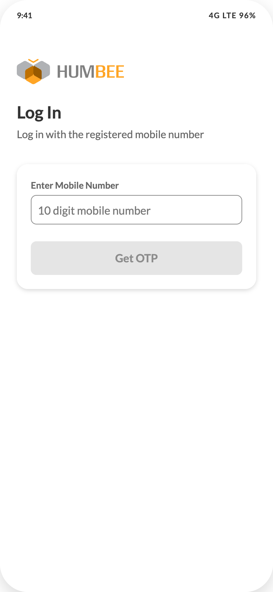

# 01 — Login: mobile number

## Purpose
Authenticate an already-registered influencer. There is no sign-up path in the app — VCPs onboard influencers on the operations platform.

## Layout
No header, no bottom nav. Scroll container, `min-height:100%`, padding **24px**, column, `gap:32px`. Background white.

## Components, top to bottom
1. **Brand block** — column, `gap:24px`, `align-items:flex-start`, `padding-top:16px`. Enters with `humbeeRise` 240ms.
   - `../assets/humbee-logo.svg`, height 36px, auto width
   - Title "Log In" — 24/32/700
   - Subtitle "Log in with the registered mobile number" — 15/22, `#8C8C8C`
2. **Form panel** — column, `gap:24px`, padding 20px, radius **16**, background `rgba(255,255,255,0.78)`, `backdrop-filter: blur(12px)`, shadow `inset 0 0 0 1px rgba(255,255,255,0.9), elevation-2`
   - `Input` — label "Enter Mobile Number", placeholder "10 digit mobile number", `inputMode="numeric"`, `maxLength=10`. Input strips every non-digit and truncates to 10.
   - `Button` — size large, full width, label "Get OTP". Disabled until the number is exactly 10 digits.

## Copy (final)
- "Log In"
- "Log in with the registered mobile number"
- "Enter Mobile Number" / "10 digit mobile number"
- "Get OTP"

There is **no** "Need help?" line, no country-code selector, no "New user?" link, no terms checkbox.

## States
| State | Behaviour |
| --- | --- |
| Empty (default) | Button disabled |
| Partial (1–9 digits) | Button disabled |
| Valid (10 digits) | Button enabled, filled chestnut |
| Submitting | Show the DS button's loading treatment; block re-submit |
| Server error | Inline `HelperText` in error colour under the input. Suggested copy: "We could not send the OTP. Try again." |
| Number not registered | Same inline pattern: "This number is not registered with HUMBEE. Ask your distributor to onboard you." |

## Data
POST the raw 10-digit string. Do not prepend `+91` in the payload; the backend owns country context.
