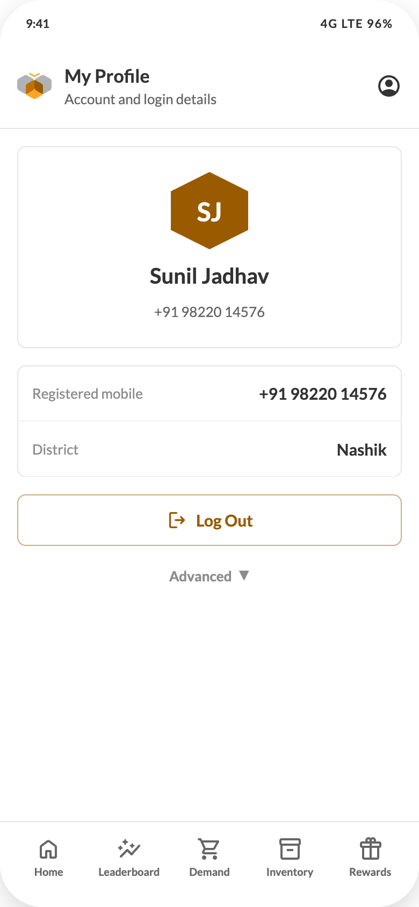

# 04 — My Profile

## Purpose
Show identity and account actions. Reached only from the header person icon.

## Layout
Header (title "My Profile", subtitle "Account and login details") + bottom nav. Body: column, `gap:16px`, padding 16px.

## Components, top to bottom
1. **Identity card** — white, radius 8, ring `inset 0 0 0 1px #E5E5E5`, padding `24px 16px`, centred column `gap:10px`
   - 72px hex avatar, background `#995A00`, initials in white 24px/700 (first letters of first two words)
   - Name 20/28/700 `#333333`
   - Number 13/20 `#666666`, formatted `+91 98220 14576`
2. **Details list** (component C9) — rows: key 13/20 `#8C8C8C` left, value 15/20/700 `#333333` right
   - "Registered mobile" → `+91 98220 14576`
   - "District" → "Nashik"
   - Trade is intentionally **not** shown
3. **Actions** — column, `gap:8px`
   - **Log Out** — 48px, radius 8, white, text + icon `#995A00`, ring `inset 0 0 0 1px rgba(153,90,0,0.5)`, 15/700, `LogoutOutlined` 20px; hover fill primary-5
   - **Advanced disclosure** (component C20) — closed by default
   - Revealed: **Delete Account** — 48px, radius 8, white, text + `Delete` icon `#CC0000`, ring `inset 0 0 0 1px` error-25, hover fill error-10; then the warning line, centred 11/16 `#8C8C8C`: "Deleting your account removes your points and gift history permanently."

## Interaction requirements
- **Log Out** must confirm ("Log out of HUMBEE?" / Cancel · Log Out) and then clear the session and return to Login.
- **Delete Account** must open a blocking confirmation naming the consequence, and should require typing the registered number or a second OTP. It is a server-side soft-delete with a retention window — coordinate with the operations platform.

## States
Loading skeleton for the identity card and two rows. No error state — this data is local to the session.
