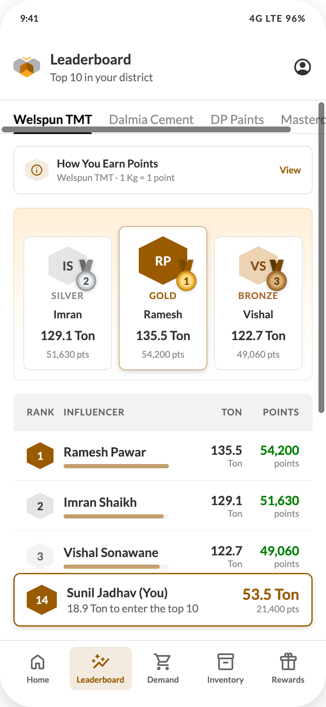

# 05 — Leaderboard

## Purpose
Public recognition. Shows the top 10 influencers for one manufacturer in the influencer's district, and where the logged-in influencer stands.

## Layout
Header (title "Leaderboard", subtitle "Top 10 in your district") + bottom nav.
Body: column with `padding-bottom:8px`; the sticky current-user card is the last child.

## Components, top to bottom
1. **Manufacturer tabs** (component C1) — flush under the header, full-bleed rule
2. Content block, padding `14px 16px 16px`, column `gap:16px`:
   1. **Points explainer** (component C17) — collapsed by default
   2. **Podium** (component C15) — visible when `showPodium` is true; hide it for manufacturers with fewer than 3 ranked influencers
   3. **Table** (component C14) — 10 rows; rows enter with `humbeeRowIn`, 35ms stagger; bars fill with `humbeeFill` 400ms on the same delay
3. **Sticky current-user card** (component C16)

## Columns
`Rank` · `Influencer` · `{unit}` · `Points`, where `{unit}` is the manufacturer's leaderboard unit: **Welspun TMT = Ton, Dalmia Cement = Bags, DP Paints = Buckets, Masterchow = Cases**.

## Copy
- Column headers: "Rank", "Influencer", the unit label, "Points"
- Current-user row: "{Name} (You)" and, below it, "{gap} {unit} to enter the top 10"
- Points explainer: "How You Earn Points", "{Manufacturer} · {base rate}", "View"/"Hide", and the note in component C17

## Rules
- No time or date filter. This is the live standing.
- Progress bar percentage = influencer points ÷ rank-1 points.
- Rank marks are hexagons for **all** ranks; only the colour changes for the top three.
- The current-user card is always visible, even when the influencer is inside the top 10 (then the gap line reads `0 {unit} to enter the top 10` — the server should instead send a "you are in the top 10" variant; confirm copy).

## States
| State | Behaviour |
| --- | --- |
| Loading | Table skeleton of 10 rows; hide the podium until data lands |
| Fewer than 10 influencers | Render what exists; do not pad |
| Fewer than 3 | Hide the podium |
| Influencer unranked | Current-user card shows "—" rank and total points, gap computed from rank 10 |
| Error | Retry card in the table's place; keep tabs usable |

## Data
Per manufacturer: an ordered array of `{rank, name, points, volume}` plus a `me` object `{rank, name, points, volume, gapToTop10}`. All values computed server-side. Never compute rank on the client.
