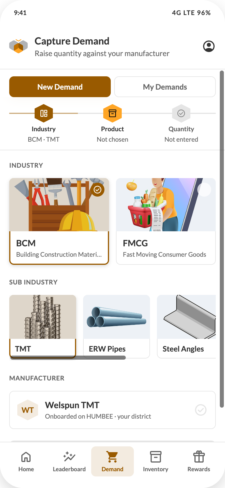

# 06 — Capture Demand

## Purpose
The app's core action: record how much of which product the influencer needs or has influenced. Everything happens on **one screen** — no wizard, no page-turns.

## Layout
Header (title "Capture Demand", subtitle "Raise quantity against your manufacturer") + bottom nav.
Body: column —
1. Module tabs row, padding `12px 16px 0`
2. Sticky demand trail
3. Content, padding 16px, column `gap:20px`

## Components, top to bottom
1. **Module tabs** — two equal buttons, `gap:6px`, height 36px, radius 8, 13/700: **New Demand** | **My Demands**. Active bg `#995A00` / white text; inactive white / `#666666` with ring `inset 0 0 0 1px #E5E5E5`. (My Demands is screen 08.)
2. **Demand trail** (component C11) — sticky; reflects live choices
3. **Industry** — overline "INDUSTRY", then a 2-up grid of image cards (component C12), `gap:12px`
   - BCM — "Building Construction Materials" — `../assets/img/bcm.png`
   - FMCG — "Fast Moving Consumer Goods" — `../assets/img/fmcg.png`
4. **Sub Industry** — appears once an industry is chosen (`humbeeRise` 200ms). Overline "SUB INDUSTRY", then a horizontally scrolling row of 116px image cards
   | Industry | Sub-industries (in order) | Image |
   | --- | --- | --- |
   | BCM | TMT | `tmt.png` |
   | BCM | ERW Pipes | `erw.png` |
   | BCM | Steel Angles | `angles.png` |
   | BCM | Paints | `paints.png` |
   | BCM | Cement | `cement.svg` (placeholder) |
   | FMCG | Food | `food.png` |
5. **Then one of two branches:**

   **(a) Manufacturer onboarded in the district** — overline "MANUFACTURER", then a stacked list of selectable rows: 36px hex with the manufacturer's two-letter mono, name 15/20/700, meta "Onboarded on HUMBEE · your district" 11/16, and a 24px `CheckCircle` on the right (chestnut when selected, neutral-25 otherwise). Selected row ring `inset 0 0 0 2px #995A00` + elevation-2; selected hex fills chestnut with white mono.

   **(b) No manufacturer onboarded** — an info banner then a flat SKU list:
   - Banner: padding `12px 14px`, radius 8, background info-10, ring `inset 0 0 0 1px` info-25, `gap:10px`; `InfoOutlined` 20px in info-100; heading 13/18/700 "No {Sub-industry} manufacturer onboarded in your district"; body 13/18 `#8C8C8C` "Pick the product you need and HUMBEE will route your demand."
   - Overline "SELECT SKU", then a list container of 52px rows: `InventoryOutlined` 20px, label 15/20 (700 when selected), `CheckCircle` 20px on the right. Selected row background primary-10.
   - Current mapping: **Steel Angles** and **ERW Pipes** take this path.

6. **Quantity card** — appears once a manufacturer (branch a) or SKU category (branch b) is chosen. White card, radius 8, padding 16px, ring 1px `#E5E5E5`, column `gap:16px`
   - Branch (a) only: `Select` — label "Select SKU", placeholder "Choose SKU", searchable, options = that manufacturer's SKUs
   - Row: `Input` label "Enter Quantity", placeholder "0", `inputMode="decimal"` (digits and one dot only) + the **UOM segmented control** (component C13) with its own "UOM" label 13/20/700 `#8C8C8C`
   - Summary line 13/20 `#8C8C8C`: "{qty or 0} {UOM} of {SKU or category or sub-industry}"
7. **Submit** — `Button` large, full width, "Submit Demand". Disabled until quantity is entered **and** (branch a: a SKU is chosen / branch b: a category is chosen).

## UOM lists
| Manufacturer | UOMs (first = default) |
| --- | --- |
| Welspun TMT | Ton, Kg |
| Dalmia Cement | Bags, Ton |
| DP Paints | Buckets, Litre |
| Masterchow | Cases, Units |
| Steel Angles (no mfr) | Kg, Nos |
| ERW Pipes (no mfr) | Kg, Nos |

## Reset rules
- Choosing an industry clears sub-industry, manufacturer, category, SKU, quantity, UOM.
- Choosing a sub-industry clears manufacturer, category, SKU, quantity, UOM.
- Choosing a manufacturer clears SKU and UOM.

## States
| State | Behaviour |
| --- | --- |
| Nothing chosen | Only industry cards visible; trail all pending; submit disabled |
| Industry chosen | Sub-industry row rises in; trail step 1 shows "{CODE}" |
| Sub-industry chosen | Manufacturer block or no-manufacturer branch rises in |
| Quantity 0 or empty | Submit disabled |
| Submitting | Button loading; block double submit |
| Server rejects | Snackbar with the server message; keep every choice intact |
| Offline | Queue the demand locally and show "Saved. It will be sent when you are back online." Sync on reconnect |

## Success
Navigate to screen 07 (Demand Captured).
