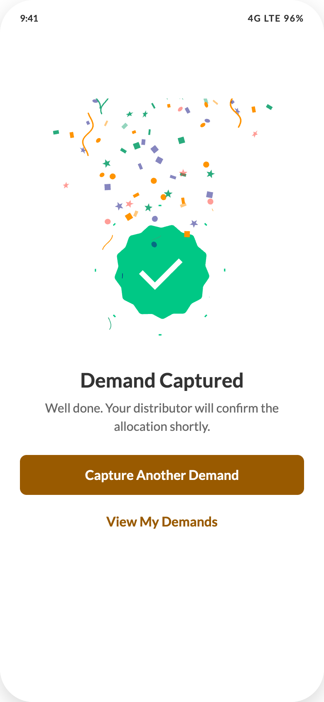

# 07 — Demand Captured (success)

## Purpose
Confirm the demand landed and offer the two sensible next actions.

## Layout
**No header, no bottom nav.** Full-bleed: `min-height:100%`, padding `32px 24px`, centred column, `gap:24px`, `text-align:center`, `position:relative`, `overflow:hidden`.

## Components
1. **Celebration Lottie** — absolutely positioned, `top:0 left:0 right:0`, height 520px, `pointer-events:none`, `z-index:2`. Source `../assets/celebration.json`, **loops**.
2. **Success Lottie** — 180×180, `z-index:1`. Source `../assets/success-green.json`, plays **once**.
3. **Text block** — column `gap:6px`
   - "Demand Captured" 24/32/700
   - "Well done. Your distributor will confirm the allocation shortly." 15/22 `#8C8C8C`
4. **Actions** — full width, column `gap:8px`
   - `Button` large, filled, "Capture Another Demand" → resets the demand form and returns to screen 06
   - `Button` large, **text** type, "View My Demands" → screen 08

## Implementation notes
- Mount each animation once; guard against re-mounting on re-render (the prototype uses a `data-mounted` flag).
- Respect `prefers-reduced-motion`: skip the celebration burst and show the success mark statically.
- The screen is not a modal — it replaces the demand screen in the stack, and the bottom nav is hidden so the two buttons are the only exits.
