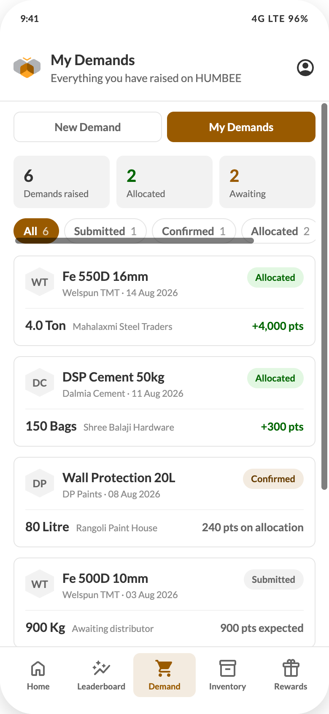

# 08 — My Demands

## Purpose
Let the influencer track every demand they have raised, across all manufacturers, and see which ones converted into allocations and points.

## Layout
Header (title "My Demands", subtitle "Everything you have raised on HUMBEE") + bottom nav. It is the second tab of the Demand module, not a fifth nav item.
Body: module tabs row (padding `12px 16px 0`), then content padding 16px, column `gap:12px`.

## Components, top to bottom
1. **Module tabs** — "New Demand" | "My Demands", My Demands active
2. **Stat tiles** — three, `gap:8px`, padding `10px 12px` (component C6)
   | Label | Value | Colour |
   | --- | --- | --- |
   | Demands raised | total count | `#333333` |
   | Allocated | count with status Allocated | `#006600` |
   | Awaiting | count with status Submitted or Confirmed | `#995A00` |
3. **Status filters** — horizontally scrolling chips (component C4): `All · Submitted · Confirmed · Allocated · Closed`, each with its count
4. **Demand cards** — one per demand, radius 8, white, ring 1px `#E5E5E5`, padding 14px, column `gap:10px`; enter with `humbeeRowIn`, 45ms stagger
   - Top row: 34px hex mono mark (`#F2F2F2` bg, `#666666` text) → product name 15/20/700 + "{Manufacturer} · {date}" 11/16 `#8C8C8C` → 24px status badge
   - Footer row (separated by `inset 0 1px 0 #F2F2F2`, `padding-top:10px`): quantity 15/20/700, note 11/16 `#8C8C8C`, and the points string right-aligned 13/20/700 — `#006600` when Allocated, `#8C8C8C` when Closed, else `#666666`
5. **Empty state** (component C19) — "No demands in this status" / "Capture a demand and it will show up here."

## Points string semantics
| Status | Example | Meaning |
| --- | --- | --- |
| Submitted | "900 pts expected" | Not yet earned |
| Confirmed | "240 pts on allocation" | Will post on allocation |
| Allocated | "+4,000 pts" | Earned |
| Closed | "+36 pts" | Earned, cycle closed |

The server should send both a numeric points value and a display string, or send status + points and let the client compose the label from a localised template.

## States
Loading → three tile skeletons + three card skeletons. Filter with zero results → empty state, tiles keep global counts. There is **no** period filter on this screen.
