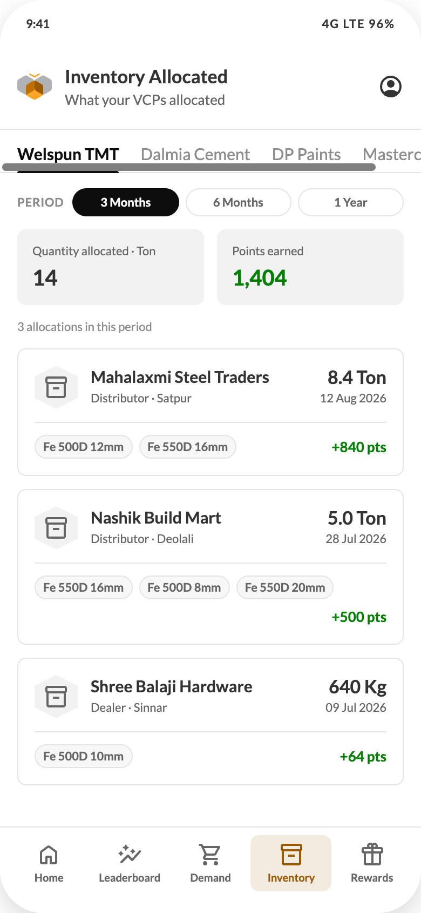

# 09 — Inventory Allocated

## Purpose
Show what VCPs actually allocated against the influencer's demands for one manufacturer, in a chosen period, and the points that came from it.

## Layout
Header (title "Inventory Allocated", subtitle "What your VCPs allocated") + bottom nav.
Body: manufacturer tabs, then content padding `14px 16px 16px`, column `gap:12px`.

## Components, top to bottom
1. **Manufacturer tabs** (component C1)
2. **Period row** (component C2) — "PERIOD" overline + `3 Months` / `6 Months` / `1 Year`
3. **Total tiles** — two, `gap:12px`, label above value (component C6)
   - "Quantity allocated · {unit}" — the period's allocations converted into the manufacturer's leaderboard unit and summed. Value `#333333`
   - "Points earned" — sum of points in the period. Value `#008000`
4. **Count line** — 11/16 `#8C8C8C`: "{n} allocation" / "{n} allocations in this period"
5. **Allocation cards** — radius 8, white, ring 1px `#E5E5E5`, padding 16px, column `gap:12px`; enter with `humbeeRowIn`, 50ms stagger
   - Top row: 40px hex tile (`#F2F2F2` bg) with `InventoryOutlined` 24px → VCP name 15/20/700 + "{Distributor|Dealer} · {place}" 11/16 `#8C8C8C` → right column quantity 17/22/700 and date 11/16 `#8C8C8C`
   - Footer row (separated by `inset 0 1px 0` border-subtle, `padding-top:12px`): SKU pills — height 22px, padding `0 8px`, radius pill, background `#F2F2F2`, ring 1px border-subtle, 11/16/600 `#8C8C8C`, wrapping — then "+{points} pts" right-aligned 13/20/700 `#008000`

## Unit conversion (must move server-side)
The totals are expressed in the manufacturer's leaderboard unit. The prototype uses:
| Manufacturer | Base unit | Conversions |
| --- | --- | --- |
| Welspun TMT | Ton | 1 Ton = 1; 1 Kg = 0.001 |
| Dalmia Cement | Bags | 1 Bag = 1; 1 Ton = 20 Bags |
| DP Paints | Buckets | 1 Bucket = 1; 1 Litre = 0.05 |
| Masterchow | Cases | 1 Case = 1; 1 Unit = 1/12 |

These factors are illustrative. **The API should return both the raw quantity with its UOM and a normalised quantity in the manufacturer's base unit**, so the client never converts.

## States
| State | Behaviour |
| --- | --- |
| Loading | Two tile skeletons + three card skeletons |
| No allocations in period | Empty state (component C19): "No allocations in this period" / "Try a longer period or another manufacturer." Tiles show 0 |
| Long VCP names | Ellipsise on one line |
| Many SKUs | Pills wrap; card grows |
