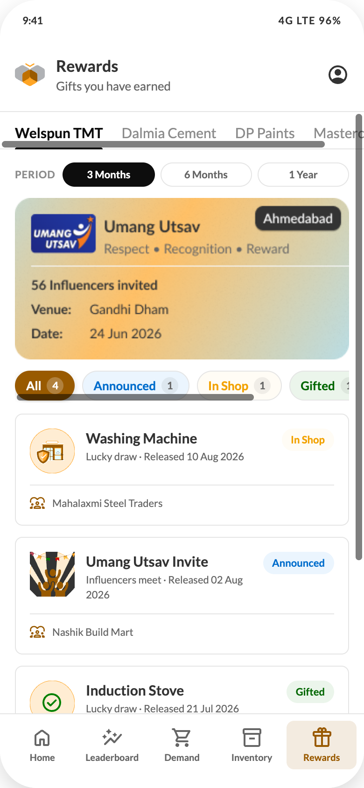

# 10 — Rewards

## Purpose
Show the gifts the influencer has earned from one manufacturer in a period, their fulfilment status, and the Umang Utsav invitation.

## Layout
Header (title "Rewards", subtitle "Gifts you have earned") + bottom nav.
Body: manufacturer tabs, then content padding `14px 16px 16px`, column `gap:12px`.

## Components, top to bottom
1. **Manufacturer tabs** (component C1)
2. **Period row** (component C2)
3. **Umang Utsav banner** — `../assets/img/umang-utsav-banner.png`, `width:100%`, auto height, radius 8, `display:block`
   The supplied bitmap shows: the Umang Utsav mark, the title "Umang Utsav", the line "Respect · Recognition · Reward", a dark pill with the city ("Ahmedabad"), then a divided block with "56 Influencers invited", "Venue — Gandhi Dham" and "Date — 24 Jun 2026", over a white→amber gradient.
   **If any of that must be dynamic**, rebuild it as markup instead of a bitmap:
   - Card, radius 8, `overflow:hidden`, background `linear-gradient(115deg,#FFFFFF 0%,#FFF3E0 40%,#FFC978 100%)`, ring `inset 0 0 0 1px` primary-25
   - Header row padding 14px, `gap:12px`: `ProductMark name="UmangUtsav" size={48}` → title 17/22/700 `#333333` + "Respect · Recognition · Reward" 13/18 `#666666` → city pill (26px, padding `0 12px`, radius pill, `#333333` bg, white 12/16/700)
   - Body block padding `12px 14px 14px`, separated by `inset 0 1px 0 rgba(0,0,0,0.10)`, column `gap:6px`: "{n} Influencers invited" 13/20/700, then "Venue" / "Date" rows with a 44px label column (`#666666`) and the value at 700 `#333333`
4. **Status filters** — horizontally scrolling chips with counts (component C3): `All · Announced · In Shop · Gifted · Redeemed`. Counts respect the selected period and manufacturer
5. **Gift cards** — radius 8, white, ring 1px `#E5E5E5`, padding 16px, column `gap:12px`; enter with `humbeeRowIn`, 50ms stagger
   - Top row: `ProductMark size={48}` (`UmangUtsav` / `SHOP` / `Approved` / `TRIP`) → gift name 15/20/700 + "{kind} · Released {date}" 11/16 `#8C8C8C` → 24px status badge
   - Footer row (separated by `inset 0 1px 0` border-subtle, `padding-top:12px`), 11/16 `#8C8C8C`: `VCPManagement` 16px in `#995A00` + the VCP name
6. **Empty state** (component C19) — "No gifts in this status" / "Try another status or manufacturer."

## Removed by decision
There is **no** "Next lucky draw entry — 3,200 points to go" progress card on this screen. Do not reintroduce it.

## Gift status meanings
| Status | Meaning |
| --- | --- |
| Announced | The influencer has won it; fulfilment not started |
| In Shop | Available for collection at the VCP's shop |
| Gifted | Handed over |
| Redeemed | Closed in the system |

## States
Loading → banner skeleton + three card skeletons. Filter with zero results → empty state (filters and banner stay). Period with zero gifts → same empty state with all counts at 0.
