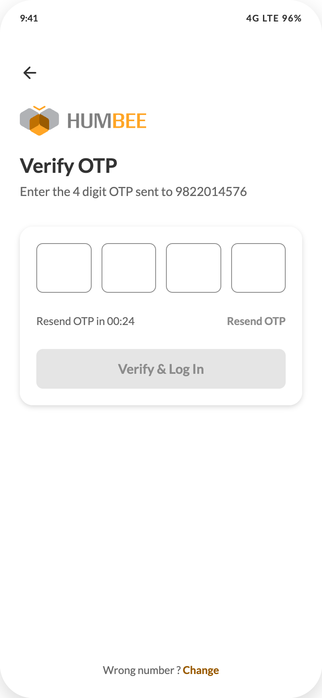
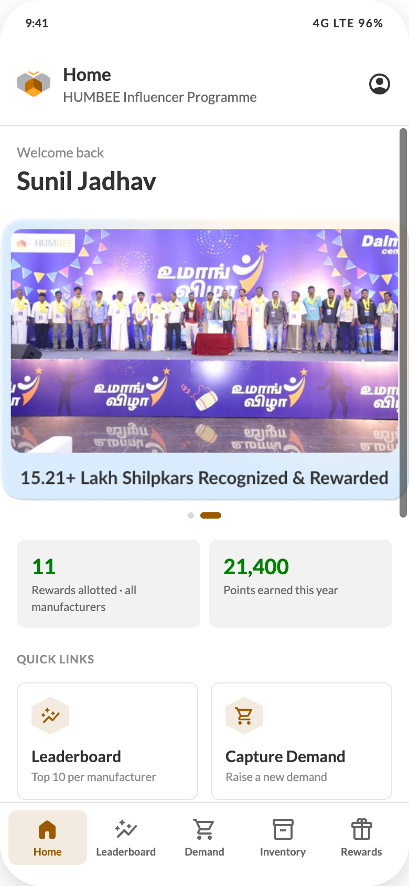

# HUMBEE Influencer App — Build Specification

**Single-document build spec.** Everything needed to implement the HUMBEE Influencer App mobile client, pixel-accurately, in one file. Written to be read by a coding agent in one pass.

---

## 0. How to use this document

### 0.1 Paste this as your opening instruction

> Build the HUMBEE Influencer App mobile client from \`HUMBEE-INFLUENCER-APP-BUILD-SPEC.md\`.
>
> Read the whole spec before writing code. Then work in the order given in §10 (Implementation plan): design tokens → primitive components → app shell → Login → Home → Leaderboard → Inventory Allocated → Rewards → Capture Demand → My Demands → Profile → Demand Captured.
>
> Rules: §2 is the only source of colour, type, spacing, radius, shadow and motion values — never a framework default and never a new colour. §3 gives exact component geometry; §4 gives one spec per screen with final copy. Wire every screen to the fixtures in \`data/\` before any network code. Every state in §9 must exist. Do not add features that are not in §1.
>
> The HTML files in \`design/\` are a **design reference**, not source to port — see §0.3.
>
> Confirm the stack with me before Phase 0, then build one phase at a time and stop for review after each.

### 0.2 What ships alongside this document

| Path | What it is | How to use it |
| --- | --- | --- |
| \`design/prototype-standalone.html\` | The complete interactive prototype, offline, with a screen navigator | The **visual reference of record**. Open it whenever this spec is ambiguous. It shows selected, filtered, empty, loading and success states that no still can. |
| \`screens/01…10.png\` | A still of every screen at 390×844 | Diff your implementation against these |
| \`data/*.json\` | 8 fixtures matching §7's response shapes exactly | Build every screen on these first; swapping to the API is then one line per screen |
| \`assets/\` | Logos, banners, industry illustrations, two Lottie files | Ship these as-is; do not redraw |
| \`design/tokens/*.css\` | The HUMBEE Design System token files | Port to your platform's token format rather than retyping §2 |
| \`HUMBEE Influencer App - Design Brief.html\` | Shareable brief for non-engineers | Context only; this spec supersedes it |

### 0.3 What the design files are, and are not

\`design/prototype-standalone.html\` and \`design/HUMBEE Influencer App.dc.html\` were authored in a browser-based design tool. Its runtime constructs — \`support.js\`, \`<x-dc>\`, \`<sc-for>\`, \`<sc-if>\`, \`<x-import>\`, \`renderVals()\` — are authoring plumbing with no place in the product. **Do not port them.** Read them as:

| In the design file | Means |
| --- | --- |
| \`<sc-for list="{{ items }}" as="item">\` | a list render — \`items.map(...)\`, \`FlatList\`, \`v-for\` |
| \`<sc-if value="{{ flag }}">\` | a conditional render |
| \`<x-import component-from-global-scope="HUMBEEDesignSystem_39dc75.Button">\` | your own Button, built from the HUMBEE Design System |
| \`renderVals()\` | derived state / selectors / a view model |
| inline \`style="…"\` | the authoritative values — transcribe them, they are not arbitrary |

Everything else in the design files — every hex value, size, line-height, radius, shadow, padding, duration and string of copy — **is final** and is restated in this spec.

### 0.4 Non-negotiables

1. **Fidelity.** Recreate the UI pixel-accurately at 390×844. Where a value is not stated, fall back to §2, never to a framework default.
2. **Type is Lato** (400/600/700) throughout, at the 1.54 line-height ratio. No substitutions.
3. **Icons are the HUMBEE set** (102 in-house glyphs). Do not substitute Lucide, Material or Heroicons.
4. **Chestnut \`#995A00\` is for emphasis only** — primary buttons, active nav, rank 1, the current-user row, links. Structure is grey. Points are green \`#008000\`.
5. **The hexagon clip-path** \`polygon(50% 0%,100% 25%,100% 75%,50% 100%,0% 75%,0% 25%)\` is the brand shape. It appears on avatars, rank marks, trail steps, icon tiles — and on skeleton placeholders.
6. **No gradients** except the two named in §2. **No emoji** in product copy. **Nothing scales on press.**
7. **The server owns every number.** Points, ranks, unit conversions and statuses are computed server-side. The prototype computes them on the client only so the design can be demonstrated.
8. **Copy is final**, including the Indian typographic conventions: spaced question marks (\`Wrong number ?\`), \`₹\` with Indian digit grouping, \`Intl.NumberFormat('en-IN')\` for all numbers.
9. **Accessibility.** Minimum touch target 44×44. Minimum body size 13px; 11px only for overlines and meta. Every screen survives a slow network with a skeleton (§3 C21). \`prefers-reduced-motion\` honoured.
10. **Do not add features.** The scope is the ten screens in §4. If something feels missing — search, notifications, chat, referral — it was deliberately excluded; see §1 Excluded.

### 0.5 Contents

| § | Section | Answers |
| --- | --- | --- |
| 1 | Product and scope | Who uses it, the domain vocabulary, what is in and out of v1 |
| 2 | Design tokens | Every colour, type size, spacing, radius, shadow, motion value |
| 3 | UI kit and components | 21 components with exact geometry and every state |
| 4 | Screens | One spec per screen: layout, components, final copy, states, data |
| 5 | Interactions and motion | Keyframes, durations, gestures, loading behaviour, reduced motion |
| 6 | State and navigation | Navigation graph, state shape, derived values, reset rules, persistence |
| 7 | API contract | Proposed endpoints with request/response JSON |
| 8 | Data model | Entities, reference data, points rules, formatting |
| 9 | QA checklist | Every state that must be implemented and verified |
| 10 | Implementation plan | Stack recommendation, phased build order, definition of done |

### 0.6 Open items — confirm before or during build

| Item | Needed from |
| --- | --- |
| Real field names for the leaderboard, allocation and rewards payloads — §7 is a **proposal** derived from the design, not from the HUMBEE operations platform | Backend |
| The authoritative points multiplier table per manufacturer and SKU | Programme |
| OTP provider, resend policy and rate limits — the design assumes 24 seconds | Platform |
| Whether the Umang Utsav venue, date and invitee count must be dynamic — currently a supplied bitmap, with a markup rebuild spec in §4.10 | Marketing |
| A Cement illustration to replace the flat vector placeholder, plus final brand imagery | Brand |

None of these block Phase 0–2. All of them block shipping.

---

---

## 01 — Product and scope

### Who uses it
**Influencers** in the Indian construction and FMCG trade: painters, bar benders, masons, carpenters, contractors. They influence which brand of material a site or household buys but do not own the purchase. HUMBEE rewards that influence.

Typical user profile: Android phone (often <₹12,000), intermittent 4G, comfortable with WhatsApp-level UI, reads Marathi/Hindi more fluently than English, motivated by tangible gifts and public recognition.

### Vocabulary (use these exact terms in code and UI)
| Term | Meaning |
| --- | --- |
| **Influencer** | The app's user. Never "customer" or "user" in UI copy. |
| **VCP** | Value Chain Partner — a distributor or dealer. Shown as "Distributor" / "Dealer" in UI. |
| **Manufacturer** | The brand whose material is sold (Welspun TMT, Dalmia Cement, DP Paints, Masterchow). |
| **Industry** | Top-level category: BCM (Building Construction Materials) or FMCG. |
| **Sub-industry** | TMT, ERW Pipes, Steel Angles, Paints, Cement, Food. |
| **Demand** | A quantity of a SKU an influencer says they need/influenced. |
| **Allocation** | A VCP assigning inventory against demand. Points post on allocation. |
| **Points** | Earned per unit allocated; multiplied for premium SKUs. |
| **Umang Utsav** | The programme's influencer recognition event. |
| **Lucky draw** | Gift mechanism; entries earned with points. |
| **Shilpkar** | Programme term for the influencer community (appears on Home banner). |

### The core loop
1. Influencer captures a **demand** (industry → sub-industry → manufacturer → SKU → quantity + UOM).
2. A **VCP allocates** inventory against it.
3. **Points post** on allocation, per the manufacturer's multiplier table.
4. Points drive **leaderboard rank** (per manufacturer) and **lucky-draw entries**.
5. **Gifts** are announced, placed in shop, gifted, redeemed. Top influencers get **Umang Utsav** invites.

### Modules in v1 (10 screens)
| # | Screen | Route id in prototype |
| --- | --- | --- |
| 1 | Login — mobile number | `login-phone` |
| 2 | Login — verify OTP | `login-otp` |
| 3 | Home | `home` |
| 4 | Profile | `profile` |
| 5 | Leaderboard | `leaderboard` |
| 6 | Capture Demand | `demand` |
| 7 | Demand Captured (success) | `demand-done` |
| 8 | My Demands | `demands` |
| 9 | Inventory Allocated | `allocation` |
| 10 | Rewards | `rewards` |

### Excluded from v1 — deliberate
- No account creation in-app. Influencers are onboarded by a VCP on the operations platform; the app only logs in an already-registered mobile number.
- No e-Pin, no password, no `+91` country-code selector (India-only).
- No notifications centre and no bell icon in the header.
- No global search, no chat/support inbox, no referral flow.
- No time/date filter on the leaderboard (it is always the live standing).
- No manufacturer switcher on Home — manufacturer context lives inside the module screens.
- Delete Account exists but is intentionally **not** surfaced directly; it sits behind an "Advanced" disclosure on Profile.

### Business rules encoded in the design
1. Leaderboard shows the **top 10 for one manufacturer at a time**; the logged-in influencer is pinned in a sticky footer card with the gap needed to enter the top 10.
2. Leaderboard has **no period filter**. Allocation and Rewards **do** (3 months / 6 months / 1 year).
3. A sub-industry may have **no onboarded manufacturer in the influencer's district**. The demand flow then replaces the manufacturer picker with an info banner plus a flat SKU-category list, and HUMBEE routes the demand.
4. Quantity is always captured with a **UOM** from a manufacturer-specific list, and points are computed on the base unit.
5. Gift statuses are exactly: **Announced → In Shop → Gifted → Redeemed**.
6. Demand statuses are exactly: **Submitted → Confirmed → Allocated → Closed**.

---

## 02 — Design tokens

Source: HUMBEE Design System (Figma `HUMBEE_Design_System.fig`, 531 variables). The CSS token files shipped in `tokens/` are the machine-readable version — port them to your platform's token format rather than retyping values.

### Colour

#### Brand
| Token | Value | Use in this app |
| --- | --- | --- |
| `--brand-primary` / primary-100 | `#995A00` | Chestnut. Emphasis only: primary button, active nav, rank-1 medal, current-user ring, links, active UOM, selected card ring |
| primary-200 (dark) | `#7A4800` | Hover/pressed on filled primary; status text on Redeemed chip |
| primary-50 | `#CC9A4D` | — |
| primary-25 | `rgba(153,90,0,0.25)` | Card ring on hover, podium panel ring |
| primary-10 | `rgba(153,90,0,0.10)` | Icon-tile background, active nav pill, Redeemed chip background |
| primary-5 | `rgba(153,90,0,0.05)` | Hover fill on text/ghost controls |
| `--brand-secondary` | `#FFA525` | Crayola amber. Active step in the demand trail; podium gradient |
| secondary tint | `rgba(255,165,37,0.18)` → `0.04` | Podium panel gradient |

#### Neutrals used in this app
| Value | Use |
| --- | --- |
| `#FFFFFF` | All surfaces: header, cards, screen background, bottom nav |
| `#F7F7F7` | DS page background (not used — this app is white-first) |
| `#F2F2F2` | Sunken fills: stat tiles, table header, progress track, row hairlines, UOM group |
| `#E5E5E5` | Card borders (as `inset 0 0 0 1px`), header/nav divider, silver medal hex |
| `#D9D9D9` | Inactive carousel dot |
| `#8C8C8C` | Tertiary text: meta, overlines, inactive tab label, captions |
| `#666666` | Secondary text: stat labels, sub-values, inactive filter text |
| `#333333` | Primary text |
| `#0D0D0D` | Base black. Active manufacturer tab label + its 2px rule, active period pill |
| `#EDF1F6` | Unified background tint of all industry illustrations |

#### Semantic
| Token | Value | Use |
| --- | --- | --- |
| success-100 | `#008000` | Points values, "Points earned" stat |
| success (custom) | `#006600` | Allocated demand emphasis (deeper green for small text) |
| success-10 / -200 | `rgba(0,128,0,0.10)` / `#006600` | Gifted status chip bg / fg |
| error-100 | `#CC0000` | Delete Account label |
| error-25 / -10 | `rgba(204,0,0,0.25)` / `rgba(204,0,0,0.10)` | Delete button ring / hover |
| warning-10 / -200 | `rgba(255,191,64,0.10)` / `#BF8000` | In Shop status chip |
| info-10 / -25 / -100 / -200 | `rgba(0,129,242,0.10)` / `0.25` / `#0081F2` / `#0067C1` | No-manufacturer banner; Announced status chip |

#### Medal palette (leaderboard podium)
| Rank | Hex avatar bg | Avatar text | Label | Label colour | Ribbon dark / light | Disc outer / mid / inner | Number |
| --- | --- | --- | --- | --- | --- | --- | --- |
| 1 Gold | `#995A00` | `#FFFFFF` | Gold | `#995A00` | `#7A4800` / `#995A00` | `#C98A0F` / `#F0B542` / `#FFD983` | `#6B3F00` |
| 2 Silver | `#E5E5E5` | `#4A4A4A` | Silver | `#8C8C8C` | `#6B6B6B` / `#8C8C8C` | `#9AA0A6` / `#C9CDD2` / `#EDEFF1` | `#4A4A4A` |
| 3 Bronze | `#EBD3B4` | `#8A4B12` | Bronze | `#A9662B` | `#5C3600` / `#7A4800` | `#9A6A2E` / `#BE8A4C` / `#DCB07A` | `#5C3600` |

Leaderboard row rank marks (ranks 1–3) use `#995A00`/white, `#E5E5E5`/`#333333`, `#F2F2F2`/`#666666` respectively; rank 4+ uses `#F2F2F2`/`#666666`.

Progress bars: rank 1–3 `rgba(153,90,0,0.55)`, rank 4+ `rgba(153,90,0,0.30)`, on a `#F2F2F2` track.

#### The two permitted gradients
1. Podium panel: `linear-gradient(180deg, rgba(255,165,37,0.18) 0%, rgba(255,165,37,0.04) 62%, rgba(255,255,255,0) 100%)`
2. Leaderboard sticky footer fade: `linear-gradient(0deg, #FFFFFF 60%, rgba(255,255,255,0))`

### Typography — Lato
Ratio 1.54. Weights: 400 Regular, 600 SemiBold, 700 Bold.

| Role | Size / line-height / weight | Where |
| --- | --- | --- |
| Screen title (login) | 24 / 32 / 700 | "Log In", "Verify OTP", "Demand Captured", Home welcome name |
| Header title | 17 / 24 / 700 | App-bar title |
| Header subtitle | 13 / 18 / 400 | App-bar second line |
| Section heading | 20 / 28 / 700 | Profile name |
| Stat value | 20 / 26–28 / 700 | Stat tiles |
| Body large | 15 / 22 / 400 | Login subtitles, empty-state body |
| Row title | 15 / 20 / 700 | Card titles, quick-link labels, manufacturer names |
| Leaderboard name | 15 / 20 / 600 | Influencer name in rows |
| Body | 13 / 20 / 400 | Profile keys, helper lines, summary |
| Body bold | 13 / 18–20 / 700 | Chip labels, points card title, medal figures |
| Overline | 11 / 20 / 700, +0.5px, UPPERCASE | "INDUSTRY", "QUICK LINKS", "MY REWARDS", "PERIOD" |
| Meta | 11 / 16 / 400 | Card meta, VCP line, stat labels |
| Table header | 11 / 16 / 700, +0.6px, UPPERCASE | Leaderboard column header |
| Nav label | 10 / 14 / 700 | Bottom nav |
| OTP digit | 24 / — / 700, centred | OTP boxes |

There is **no 14px body size** in the system. Do not introduce one.

### Spacing
4pt grid. Used values: 2, 4, 6, 8, 10, 12, 14, 16, 20, 24, 32.

Screen padding is **16px**; login screens use **24px**. Card inner padding is **14px** or **16px**. Gap between stacked cards is **12px**; between sections **16–20px**.

### Radius
| Token | Value | Use |
| --- | --- | --- |
| `--radius-s` | 4 | Point-rule rows, UOM buttons |
| `--radius-m` | 8 | **Default.** Cards, tiles, buttons, inputs, nav pills, OTP boxes |
| `--radius-l` | 16 | Login/OTP form panel |
| `--radius-pill` | 32 / 999 | Status chips, filter chips, period pills, carousel dots, progress bars |
| — | 40 | Phone frame in the prototype only (not a product value) |

### Borders
Borders are **inset box-shadows**, never CSS borders, so they never affect layout.
- Card: `inset 0 0 0 1px #E5E5E5`
- Selected card: `inset 0 0 0 2px #995A00` + elevation-2
- Current-user row: `inset 0 0 0 1.5px #995A00` + elevation-2
- Row hairline: `inset 0 -1px 0 #F2F2F2`
- Section divider: `inset 0 -1px 0 #E5E5E5` (below header) / `inset 0 1px 0 #E5E5E5` (above nav)
- Outline button: `inset 0 0 0 1px rgba(153,90,0,0.5)`

### Elevation
Black at 15% opacity. Five steps, 0–4.
| Token | Value | Use |
| --- | --- | --- |
| `--elevation-1` | `0 1px 3px rgba(0,0,0,0.15)` | Resting cards (rail panels) |
| `--elevation-2` | `0 2px 8px rgba(0,0,0,0.15)` | Selected cards, current-user card, login panel, active filter chip |
| `--elevation-4` | `0 8px 24px rgba(0,0,0,0.15)` | Prototype phone frame only |

No coloured or tinted shadows.

### Motion
| Duration | Easing | Use |
| --- | --- | --- |
| 120ms | `cubic-bezier(0.4,0,0.2,1)` | Colour, background, box-shadow changes |
| 160ms | same | Points-card expand |
| 200ms | same | Size/position change; row entry; caret rotate |
| 240–260ms | same | Screen/section rise |
| 400ms | same | Progress-bar fill |
| 420ms | same | Carousel slide |
| 4000ms interval | — | Carousel auto-advance |

Keyframes used (see §5 for full definitions): `humbeeRise`, `humbeeRowIn`, `humbeeFill`, `humbeeSlide`, `humbeeGlow`.

Nothing scales or shrinks on press. No bounce, no spring.

### Iconography
The HUMBEE icon set (102 in-house glyphs, 24×24 grid, solid fills, tinted with `currentColor`). **Do not substitute Lucide / Material / Heroicons.** Icons used in this app:

| Icon name | Where | Size |
| --- | --- | --- |
| `Account` | Header profile button | 24 |
| `ArrowBack` | Back button (OTP screen) | 24 |
| `HomeFilled` / `HomeOutlined` | Bottom nav — Home | 24 |
| `PerformanceFilled` / `PerformanceOutlined` | Bottom nav — Leaderboard; Home quick link | 24 / 20 |
| `ShoppingCartFilled` / `ShoppingCartOutlined` | Bottom nav — Demand; Home quick link | 24 / 20 |
| `InventoryOutlined` | Bottom nav — Inventory; allocation card; SKU rows; trail step 2 | 24 / 20 |
| `RewardsOutlined` | Bottom nav — Rewards; Home quick link | 24 / 20 |
| `InfoOutlined` | Points card tile; no-manufacturer banner | 16 / 20 |
| `CheckCircle` | Selection ticks; trail step 3 | 16 / 20 / 24 |
| `Cluster` | Trail step 1 (Industry) | 16 |
| `VCPManagement` | Gift card VCP line | 16 |
| `LogoutOutlined` | Profile — Log Out | 20 |
| `Delete` | Profile — Delete Account | 20 |

Filled = active, outlined = inactive, for every nav glyph.

**ProductMark** (full-colour programme marks, 48px): `UmangUtsav`, `SHOP`, `Approved`, `TRIP` — used on gift cards and the Home rewards list.
**Illustration** (multi-colour, 120px): `NoDataFound` — used in both empty states.

### The brand shape
`clip-path: polygon(50% 0%, 100% 25%, 100% 75%, 50% 100%, 0% 75%, 0% 25%)`

A flat-top hexagon. Applied to: leaderboard rank marks (32px), podium avatars (58px rank 1 / 46px others), profile avatar (72px), current-user mark (36px), quick-link icon tiles (36px), points-card icon tile (28px), demand trail steps (32px), manufacturer initials (36px), My Demands manufacturer mark (34px), allocation icon tile (40px).

---

## 03 — UI kit and component inventory

Every component below is either (a) a HUMBEE Design System primitive you should take from the DS package, or (b) an app-level composite assembled in this design. Specs are exact.

---

### A. Design-system primitives used

| Component | Props used in this app | Notes |
| --- | --- | --- |
| `Button` | `size="large"`, `fullWidth`, `disabled`, `type="text"` | Large = 48px height, radius 8, Lato 700. Filled primary `#995A00`, hover → `#7A4800`, disabled → neutral-25 bg + neutral-100 text (never opacity fade) |
| `Input` | `label`, `placeholder`, `inputMode`, `maxLength`, `value`, `onChange` | 40px control + label above; total block ≈68px. Label copy is instructional ("Enter Mobile Number") |
| `Select` | `label`, `placeholder`, `options`, `value`, `onChange`, `searchable` | Used once, for SKU choice |
| `Icon` | `name`, `size` | See icon table in tokens doc |
| `ProductMark` | `name`, `size={48}` | Gift/programme marks |
| `Illustration` | `name="NoDataFound"`, `size={120}` | Empty states |
| `Chip` | — | Present in the DS; this build uses custom pills for filters (spec below) because of the count badge |
| `ProgressLinear` | — | Available; not used in the current build |

---

### B. App shell

#### B1. Status bar (prototype only)
44px, transparent, 11/20/700. `9:41` left, `4G LTE 96%` right. **Replace with the platform status bar.**

#### B2. App header (`showChrome` = every screen except the two login screens and Demand Captured)
- Layout: `flex`, `align-items:center`, `gap:12px`, padding `12px 16px 16px 16px`, min-height 76px
- Background `#FFFFFF`, divider `inset 0 -1px 0 #E5E5E5`, `z-index:2`
- **Left**: HUMBEE logomark, 32×32 (`assets/humbee-logomark.svg`)
- **Centre**: title 17/24/700 + subtitle 13/18 `#8C8C8C`; both single-line with ellipsis
- **Right**: 40×40 tap target, radius 8, `Icon name="Account" size={24}`, colour `#333333`, hover fill `primary-5`, `margin-right:-8px` for optical alignment. Navigates to Profile. **No hexagon around it, no notification bell.**

Titles and subtitles by screen:
| Screen | Title | Subtitle |
| --- | --- | --- |
| Home | Home | HUMBEE Influencer Programme |
| Profile | My Profile | Account and login details |
| Leaderboard | Leaderboard | Top 10 in your district |
| Capture Demand | Capture Demand | Raise quantity against your manufacturer |
| My Demands | My Demands | Everything you have raised on HUMBEE |
| Inventory Allocated | Inventory Allocated | What your VCPs allocated |
| Rewards | Rewards | Gifts you have earned |

The subtitle must **never** repeat the selected manufacturer name — the manufacturer tab bar already shows it.

#### B3. Bottom navigation (same visibility rule as the header)
- `flex`, background `#FFFFFF`, top divider `inset 0 1px 0 #E5E5E5`, padding `8px 8px 20px 8px` (the 20px is the home-indicator inset)
- Five equal items: **Home · Leaderboard · Demand · Inventory · Rewards**
- Item: column, `gap:2px`, padding `6px 0`, radius 8; icon 24 then label 10/14/700
- Active: filled icon, colour `#995A00`, background `primary-10`. Inactive: outlined icon, colour `#8C8C8C`, transparent
- `demand`, `demands` and `demand-done` all activate the **Demand** tab

---

### C. Composites

#### C1. Manufacturer tab bar — `ManufacturerTabs`
Appears on Leaderboard, Inventory Allocated and Rewards. **This is the manufacturer switcher; it is deliberately not a chip row.**
- Horizontal scroll container, `gap:20px`, padding `0 16px`, bottom rule `inset 0 -1px 0 #E5E5E5`, scrollbar hidden
- Item: column, centred, `gap:6px`, `padding-top:12px`
- Label 15/20; active `#0D0D0D` weight 700, inactive `#8C8C8C` weight 400; colour transitions 120ms
- Underline: full item width, 2px, radius `2px 2px 0 0`; active `#0D0D0D`, inactive transparent
- Selecting a manufacturer resets the gift status filter to `All`

#### C2. Period filter — `PeriodPills`
Inventory Allocated and Rewards only.
- Row: overline `PERIOD` (11/16/700, +0.4px, `#8C8C8C`) then three equal pills, `gap:6px`
- Pill: `flex:1`, height **26px**, radius pill, 11px/700 centred
- Active: bg `#0D0D0D`, text `#FFFFFF`, no ring. Inactive: bg `#FFFFFF`, text `#666666`, ring `inset 0 0 0 1px #E5E5E5`
- Options: `3 Months` (default) · `6 Months` · `1 Year`
- Deliberately **smaller than the manufacturer tabs** — manufacturer is the primary axis, period the secondary

#### C3. Status filter chip (Rewards) — `StatusFilterChip`
- `flex:none`, height 32px, padding `0 12px`, radius pill, `gap:6px`
- Label 13/18/700 + count badge: min-width 18, height 18, radius pill, 11/700
- Inactive: background = that status's tint (`Announced` info-10, `In Shop` warning-10, `Gifted` success-10, `Redeemed` primary-10; `All` = `rgba(255,255,255,0.9)`), text = that status's 200 shade, ring `inset 0 0 0 1px` border-subtle, count badge `rgba(0,0,0,0.06)` on `#8C8C8C`
- Active: background `#995A00`, text `#FFFFFF`, shadow elevation-2, count badge `rgba(255,255,255,0.24)` on `#FFFFFF`
- Order: `All · Announced · In Shop · Gifted · Redeemed`; counts are period-filtered

#### C4. Demand status filter chip (My Demands)
Same anatomy, height **30px**, count rendered inline at weight 400 / opacity 0.7. Active bg `#995A00` / `#FFFFFF`; inactive `#FFFFFF` / `#666666` with `inset 0 0 0 1px #E5E5E5`. Order: `All · Submitted · Confirmed · Allocated · Closed`.

#### C5. Status badge (read-only) — `StatusBadge`
Height 22px (Home list) or 24px (cards), padding `0 8px` / `0 10px`, radius pill, 11/16/700.
| Status | Background | Text |
| --- | --- | --- |
| Announced | info-10 | info-200 |
| In Shop | warning-10 | warning-200 |
| Gifted | success-10 | success-200 |
| Redeemed | primary-10 | primary-200 |
| Submitted | `#F2F2F2` | `#666666` |
| Confirmed | primary-10 | primary-200 |
| Allocated | `rgba(108,217,108,0.20)` | `#006600` |
| Closed | `#F2F2F2` | `#8C8C8C` |

#### C6. Stat tile — `StatTile`
`flex:1`, padding `12px 14px` (10px 12px in My Demands), radius 8, background `#F2F2F2`, column, `gap:2px`.
Home / My Demands: value 20/26/700 above label 11/16 `#666666`. Inventory Allocated: label **above** value (label 11/16 `#666666`, value 20/28/700).

#### C7. Hex avatar / mark — `HexMark`
Square box with the brand clip-path. Content is either initials (Lato 700, size scales with box) or a 16–24px icon. Sizes and colour pairs listed in the tokens doc.

#### C8. Card — `Card`
White, radius 8, `inset 0 0 0 1px #E5E5E5`, padding 14 or 16, column with `gap:10–12px`. A card's footer row is separated by `inset 0 1px 0 #F2F2F2` (or border-subtle) with `padding-top:10–12px` — never a real border.

#### C9. List container
White, radius 8, `inset 0 0 0 1px #E5E5E5`, `overflow:hidden`; each row carries `inset 0 -1px 0 #F2F2F2` as its own hairline. Row min-height 52–56px, padding `10–12px 14px`.

#### C10. OTP box
4 boxes, `gap:12px`, each `flex:1`, height 60px, radius 8, centred Lato 700 24px, no border, no outline.
Empty ring `inset 0 0 0 1px` neutral-100; filled ring `inset 0 0 0 2px #995A00`; 120ms transition. `inputMode="numeric"`, `maxLength=1`, digits only.

#### C11. Demand trail (honeycomb stepper) — `DemandTrail`
Sticky at the top of the Capture Demand scroll area (`top:0`, `z-index:2`), padding `12px 16px`, background `rgba(255,255,255,0.94)` + `backdrop-filter: blur(10px)`, bottom rule `inset 0 -1px 0 #E5E5E5`.
Three equal steps: **Industry · Product · Quantity**. Each step is a column (`gap:4px`) containing a connector line (absolute, `top:15px`, 2px), a 32px hex with a 16px icon, a label 11/14/700 and the chosen value 11/14 `#8C8C8C` (ellipsised).
| Step state | Hex bg | Hex fg | Label | Connector |
| --- | --- | --- | --- | --- |
| Done | `#995A00` | `#FFFFFF` | `#333333` | primary-25 |
| Active (next to fill) | `#FFA525` | `#0D0D0D` | `#333333` | neutral-25 |
| Pending | neutral-25 | text-disabled | `#8C8C8C` | neutral-25 |

Icons: `Cluster`, `InventoryOutlined`, `CheckCircle`. Values fall back to "Not chosen" / "Not entered". **No "Step 1 of 3" counter.**

#### C12. Image selection card — `PickCard`
Industry (2-up grid, image 92px tall) and sub-industry (horizontal scroll, 116px wide, image 76px tall).
- Radius 8, white, `overflow:hidden`; ring `inset 0 0 0 1px` border-subtle → selected `inset 0 0 0 2px #995A00` + elevation-2
- Image area `background-size:cover; background-position:center`; selected adds a `rgba(153,90,0,0.18)` veil
- Industry card only: 24px circular tick badge top-right — selected `#995A00`/white, unselected `rgba(255,255,255,0.75)`/transparent icon
- Caption: industry = code 15/20/700 + name 11/16 `#8C8C8C`; sub-industry = label 13/18/700, single line

#### C13. UOM segmented control
Wrapper: `gap:4px`, padding 4px, radius 8, background `#F2F2F2`. Button: min-width 56, height 36, radius 4, 13/700. Active `#995A00`/white; inactive transparent/`#8C8C8C`. First UOM in the list is the default.

#### C14. Leaderboard table
Header row: min-height 44px, padding `12px 16px`, background `#F2F2F2`, bottom rule `inset 0 -1px 0 #E5E5E5`, 11/16/700 +0.6px uppercase `#666666`. Columns: `Rank` (32px) · `Influencer` (flex) · unit label (76px, right) · `Points` (56px, right).
Data row: min-height 60px, padding `10px 16px`, `gap:12px`, hairline `inset 0 -1px 0 #F2F2F2`; 32px hex rank mark; name 15/20/600 with a 5px progress bar underneath (radius pill, track `#F2F2F2`); volume column = value 15/18/700 + unit 11/14 `#8C8C8C`; points column = value 15/18/700 `#008000` + "points" 11/14 `#8C8C8C`.

#### C15. Podium
Panel: padding `16px 12px 12px`, radius 8, the amber gradient, ring primary-10. Three cards in `align-items:flex-end`, order **2 – 1 – 3**; rank 1 has `margin-top:0`, others `18px`.
Card: white, radius 8, padding `12px 6px`, centred column `gap:6px`; rank 1 ring primary-25 + elevation-2, others `inset 0 0 0 1px #E5E5E5`.
Contents: hex avatar (58px rank 1 / 46px) with initials; an SVG medal (30×38, `bottom:-8px right:-14px`, `drop-shadow(0 1px 2px rgba(0,0,0,0.20))`) built from two ribbon paths + three concentric discs, with the **rank number centred on the disc**; then medal label 11/14/700 +0.6px uppercase, first name 13/18/700, volume 15/20/700, points 11/14 `#8C8C8C`.

#### C16. Current-user card (sticky)
`position:sticky; bottom:0`, wrapper padding `8px 16px 16px`, wrapper background = the white fade gradient.
Card: min-height 64px, padding `12px 16px`, radius 8, white, `inset 0 0 0 1.5px #995A00` + elevation-2. 36px hex mark with rank; name "{Name} (You)" 15/20/700; gap line 13/18 `#666666`; right column volume 18/22/700 `#995A00` + points 11/14 `#8C8C8C`.

#### C17. Points explainer (collapsible)
Card with a 52px tap row: 28px hex tile with `InfoOutlined` 16 → title "How You Earn Points" 13/18/700 + base line 11/16 `#8C8C8C` ("{Manufacturer} · 1 Kg = 1 point") → right link `View` / `Hide` 11/16/700 `#995A00`.
Expanded body (`humbeeRise` 160ms): rows min-height 34px, padding `7px 10px`, radius 4, background `#F2F2F2`, label 13/18 `#333333` left, value 13/18/700 right (first row `#333333`, premium rows `#995A00`), then the note "Premium SKUs carry multiplied points. Points post once your distributor confirms the allocation." 11/16 `#8C8C8C`.

#### C18. Banner carousel
Full-bleed (`margin:0 -16px`), `overflow:hidden`. Track is 200% wide with two 50% slides; `transform: translateX(-50% × index)`, 420ms. Auto-advances every 4000ms. Dots below, centred, `gap:6px`, height 6px, radius pill; active 20px wide `#995A00`, inactive 6px `#D9D9D9`; tapping a dot jumps.

#### C19. Empty state
Centred column, padding `32px 16px`, `gap:12px`: `Illustration name="NoDataFound" size={120}`, heading 15/22/700, body 13/20 `#666666`. Copy per screen in the screen specs.

#### C20. Advanced disclosure (Profile)
40px centred row, `gap:6px`, 13/20/700 `#8C8C8C`: label "Advanced" + a caret glyph that rotates 180° over 200ms when open. Revealing shows the destructive Delete Account button and its warning line. Closed by default on every visit.

#### C21. Skeleton loader — `Skeleton`
The loading state for every data screen. Shown while the screen's data is in flight; **never** a spinner on a full screen.

**Atom.** A rectangle that shimmers:
```css
background: linear-gradient(90deg, #F2F2F2 25%, #EAEAEA 37%, #F2F2F2 63%);
background-size: 240px 100%;
animation: humbeeShimmer 1200ms linear infinite;
```
```css
@keyframes humbeeShimmer { from { background-position: -240px 0; } to { background-position: 240px 0; } }
```
Radius follows the real element it stands in for: **4px** for text lines, **8px** (`--radius-m`) for cards and tiles, **pill** for chips and pills, and the **hex clip-path** for hex marks. Never grey blocks with the wrong shape.

**Sizes for text lines**: title 13px tall at 60–65% width; meta 10px tall at 35–40% width; overline 10px tall at 44px wide.

**Screen skeleton** (the shape used in the prototype, matching the three data-list screens):
1. Tab-bar row — 4 bars, 84×14, `gap:20px`, padding `12px 16px 14px`, with the same `inset 0 -1px 0 #E5E5E5` rule as the real tab bar
2. Period row — a 44×10 overline bar + three `flex:1` pills 26px tall, `gap:8px`
3. Two `flex:1` tiles, 66px tall, radius 8, `gap:12px`
4. Three cards — real card chrome (white, radius 8, `inset 0 0 0 1px #E5E5E5`, padding 16px) containing a 40px hex mark, two text lines, a 56×22 pill, then a footer row (`inset 0 1px 0 #F2F2F2`, `padding-top:12px`) with two pills and a 52×12 value bar

**Rules**
- The skeleton keeps the **header and bottom nav live** — only the scroll body is replaced, so the user can still navigate away.
- Card and tile chrome is real; only the content inside shimmers. This is why the skeleton reads as "the screen, loading" rather than "grey boxes".
- Container carries `aria-busy="true"`; announce "Loading" once to screen readers, not per shimmer.
- Under `prefers-reduced-motion`, drop the shimmer animation and render the bars as flat `#F2F2F2`.
- Skeleton counts match what the screen typically shows (3 cards, 4 tabs, 2 tiles) — do not animate the count.
- **Do not** show a skeleton for: the two login screens, the Demand Captured screen, or any action in flight (those use the button's own loading state).

---

## 04 — Screens

Canvas for every screen: **390 × 844** (iPhone 14 logical size; design is fluid — nothing is pinned to 390 except the prototype frame). Screen background is white. Content scroll area sits between the header and the bottom nav.

| # | File | Screen | Header / nav | Notes |
| --- | --- | --- | --- | --- |
| 01 | `01-login-mobile.md` | Login — mobile number | none | 24px padding, logo lockup |
| 02 | `02-login-otp.md` | Verify OTP | none | 4 boxes, full number shown |
| 03 | `03-home.md` | Home | yes | Carousel, stats, quick links, my rewards |
| 04 | `04-profile.md` | My Profile | yes | Log Out + Advanced → Delete |
| 05 | `05-leaderboard.md` | Leaderboard | yes | Tabs, points card, podium, table, sticky me |
| 06 | `06-capture-demand.md` | Capture Demand | yes | Tabs, sticky trail, 3-step picker |
| 07 | `07-demand-captured.md` | Demand Captured | none | Two Lotties |
| 08 | `08-my-demands.md` | My Demands | yes | Stats, filters, demand cards |
| 09 | `09-inventory-allocated.md` | Inventory Allocated | yes | Tabs, period, totals, allocation cards |
| 10 | `10-rewards.md` | Rewards | yes | Tabs, period, Umang Utsav, gift list |

Each spec follows the same shape: **Purpose → Layout → Components (top to bottom) → Copy → States → Data**.

Open `prototype/prototype-standalone.html` and use the left rail to view any screen live; the rail label for each screen is given in the table below.

| Screen | Rail label |
| --- | --- |
| Login — mobile number | Mobile Number |
| Verify OTP | OTP Verification |
| Home | Banners & Quick Links |
| My Profile | My Profile |
| Leaderboard | Manufacturer Wise Ranking |
| Capture Demand | Industry, Product, Quantity |
| Demand Captured | Demand Submitted |
| My Demands | My Demands |
| Inventory Allocated | Allocation Of Inventory |
| Rewards | Rewards & Umang Utsav |

---

## 01 — Login: mobile number


### Purpose
Authenticate an already-registered influencer. There is no sign-up path in the app — VCPs onboard influencers on the operations platform.

### Layout
No header, no bottom nav. Scroll container, `min-height:100%`, padding **24px**, column, `gap:32px`. Background white.

### Components, top to bottom
1. **Brand block** — column, `gap:24px`, `align-items:flex-start`, `padding-top:16px`. Enters with `humbeeRise` 240ms.
   - `assets/humbee-logo.svg`, height 36px, auto width
   - Title "Log In" — 24/32/700
   - Subtitle "Log in with the registered mobile number" — 15/22, `#8C8C8C`
2. **Form panel** — column, `gap:24px`, padding 20px, radius **16**, background `rgba(255,255,255,0.78)`, `backdrop-filter: blur(12px)`, shadow `inset 0 0 0 1px rgba(255,255,255,0.9), elevation-2`
   - `Input` — label "Enter Mobile Number", placeholder "10 digit mobile number", `inputMode="numeric"`, `maxLength=10`. Input strips every non-digit and truncates to 10.
   - `Button` — size large, full width, label "Get OTP". Disabled until the number is exactly 10 digits.

### Copy (final)
- "Log In"
- "Log in with the registered mobile number"
- "Enter Mobile Number" / "10 digit mobile number"
- "Get OTP"

There is **no** "Need help?" line, no country-code selector, no "New user?" link, no terms checkbox.

### States
| State | Behaviour |
| --- | --- |
| Empty (default) | Button disabled |
| Partial (1–9 digits) | Button disabled |
| Valid (10 digits) | Button enabled, filled chestnut |
| Submitting | Show the DS button's loading treatment; block re-submit |
| Server error | Inline `HelperText` in error colour under the input. Suggested copy: "We could not send the OTP. Try again." |
| Number not registered | Same inline pattern: "This number is not registered with HUMBEE. Ask your distributor to onboard you." |

### Data
POST the raw 10-digit string. Do not prepend `+91` in the payload; the backend owns country context.

---

## 02 — Login: verify OTP



### Purpose
Verify the 4-digit OTP and open the app on Home.

### Layout
No header, no bottom nav. Scroll container, `min-height:100%`, padding 24px, column, `gap:32px`.

### Components, top to bottom
1. **Header block** — column, `gap:20px`, `align-items:flex-start`
   - Back button: 40×40, radius 8, `margin-left:-8px`, `Icon name="ArrowBack" size={24}`, hover fill primary-5 → returns to the mobile-number screen
   - `assets/humbee-logo.svg`, height 36px
   - Title "Verify OTP" — 24/32/700
   - Subtitle "Enter the 4 digit OTP sent to {number}" — 15/22, `#8C8C8C`. **The number is shown in full and unmasked**, exactly as entered (e.g. `9822014576`). No masking, no `+91` prefix in this line.
2. **Form panel** — same glass panel as screen 01 (radius 16, 20px padding, `gap:24px`)
   - **OTP row** — 4 boxes, `gap:12px` (component C10)
   - **Resend row** — space-between, 13/20: left "Resend OTP in 00:24" `#8C8C8C`; right "Resend OTP" 700, disabled colour `#B3B3B3` until the timer expires, then `#995A00` and tappable
   - `Button` — large, full width, "Verify & Log In". Disabled until all 4 digits are filled
3. **Footer** — `margin-top:auto`, centred, 13/20 `#8C8C8C`: "Wrong number ?" + "Change" (700, `#995A00`, tappable → screen 01). Note the space before the question mark; that is the intended Indian typographic convention.

### States
| State | Behaviour |
| --- | --- |
| Empty | Verify disabled; focus is in box 1 |
| Partial | Verify disabled |
| Complete | Verify enabled |
| Auto-advance | Entering a digit moves focus forward; backspace on an empty box moves back |
| Wrong OTP | All four rings turn error colour; message "That OTP is not correct. Try again." Boxes clear, focus returns to box 1 |
| Expired | "This OTP has expired. Request a new one." Resend becomes active immediately |
| Timer | Counts 00:24 → 00:00, once per send; resends restart it |
| Verifying | Button loading state; boxes read-only |

Implement SMS autofill (`autoComplete="one-time-code"` / Android SMS Retriever) — field users will otherwise switch apps to read the code.

### Success
On verify, navigate to **Home** and replace the auth stack (back must not return to login).

---

## 03 — Home



### Purpose
Orient the influencer: who they are, what the programme is running, and one tap to every module. Home is the landing screen after login.

### Layout
Header (title "Home", subtitle "HUMBEE Influencer Programme") + bottom nav.
Scroll body: column, `gap:20px`, padding 16px.

### Components, top to bottom
1. **Welcome block** — column, `gap:2px`
   - "Welcome back" 13/18 `#8C8C8C`
   - Influencer name 24/32/700 `#333333`
2. **Banner carousel** (component C18) — full-bleed via `margin:0 -16px`; two slides, images at natural aspect ratio, `width:100%`; auto-advance 4s; dots below
   - Slide 1 `assets/img/banner-1.png` — alt "Hoga Yogdaan Ka Samaan"
   - Slide 2 `assets/img/banner-2.png` — alt "15.21+ Lakh Shilpkars recognised and rewarded"
3. **Stat tiles** — two, `gap:8px` (component C6)
   - "Rewards allotted · all manufacturers" — count across all manufacturers, value in `#008000`
   - "Points earned this year" — `en-IN` formatted, `#008000`
4. **Quick links** — overline "QUICK LINKS", then a 2×2 grid, `gap:12px`
   - Card: white, radius 8, padding 14px, ring `inset 0 0 0 1px #E5E5E5`, column `gap:10px`; hover ring primary-25 + elevation-1
   - 36px hex tile (primary-10 bg, `#995A00` icon 20px), then label 15/20/700 and meta 11/16 `#8C8C8C`
   | Label | Meta | Icon | Target |
   | --- | --- | --- | --- |
   | Leaderboard | Top 10 per manufacturer | PerformanceOutlined | Leaderboard |
   | Capture Demand | Raise a new demand | ShoppingCartOutlined | Capture Demand |
   | Allocations | Inventory allocated | InventoryOutlined | Inventory Allocated |
   | Rewards | Gifts and Umang Utsav | RewardsOutlined | Rewards |
5. **My Rewards** — header row: overline "MY REWARDS" + "View All" (11/16/700 `#995A00`, → Rewards)
   - List container (component C9); **4 most recent gifts across all manufacturers**, newest first
   - Row: min-height 56px, padding `10px 14px`, `gap:12px`: `ProductMark size={48}` rendered at 32px box, then gift name 15/20/700 + meta "{Manufacturer} · {date}" 11/16 `#8C8C8C`, then a 22px status badge. Whole row taps through to Rewards

### Order note
Quick links sit **above** My Rewards. Carousel is full width. Both were explicit client decisions.

### States
| State | Behaviour |
| --- | --- |
| Loading | Skeletons: welcome name, two tiles, four quick-link cards, four reward rows |
| No rewards yet | Replace the list with a one-line card: "No gifts yet. Capture demands to enter the next lucky draw." Keep quick links |
| Carousel single slide | Hide the dots, disable auto-advance |
| Long name | Welcome name wraps to two lines; do not truncate |

---

## 04 — My Profile


### Purpose
Show identity and account actions. Reached only from the header person icon.

### Layout
Header (title "My Profile", subtitle "Account and login details") + bottom nav. Body: column, `gap:16px`, padding 16px.

### Components, top to bottom
1. **Identity card** — white, radius 8, ring `inset 0 0 0 1px #E5E5E5`, padding `24px 16px`, centred column `gap:10px`
   - 72px hex avatar, background `#995A00`, initials in white 24px/700 (first letters of first two words)
   - Name 20/28/700 `#333333`
   - Number 13/20 `#666666`, formatted `+91 98220 14576`
2. **Details list** (component C9) — rows: key 13/20 `#8C8C8C` left, value 15/20/700 `#333333` right
   - "Registered mobile" → `+91 98220 14576`
   - "District" → "Nashik"
   - Trade is intentionally **not** shown
3. **Actions** — column, `gap:8px`
   - **Log Out** — 48px, radius 8, white, text + icon `#995A00`, ring `inset 0 0 0 1px rgba(153,90,0,0.5)`, 15/700, `LogoutOutlined` 20px; hover fill primary-5
   - **Advanced disclosure** (component C20) — closed by default
   - Revealed: **Delete Account** — 48px, radius 8, white, text + `Delete` icon `#CC0000`, ring `inset 0 0 0 1px` error-25, hover fill error-10; then the warning line, centred 11/16 `#8C8C8C`: "Deleting your account removes your points and gift history permanently."

### Interaction requirements
- **Log Out** must confirm ("Log out of HUMBEE?" / Cancel · Log Out) and then clear the session and return to Login.
- **Delete Account** must open a blocking confirmation naming the consequence, and should require typing the registered number or a second OTP. It is a server-side soft-delete with a retention window — coordinate with the operations platform.

### States
Loading skeleton for the identity card and two rows. No error state — this data is local to the session.

---

## 05 — Leaderboard


### Purpose
Public recognition. Shows the top 10 influencers for one manufacturer in the influencer's district, and where the logged-in influencer stands.

### Layout
Header (title "Leaderboard", subtitle "Top 10 in your district") + bottom nav.
Body: column with `padding-bottom:8px`; the sticky current-user card is the last child.

### Components, top to bottom
1. **Manufacturer tabs** (component C1) — flush under the header, full-bleed rule
2. Content block, padding `14px 16px 16px`, column `gap:16px`:
   1. **Points explainer** (component C17) — collapsed by default
   2. **Podium** (component C15) — visible when `showPodium` is true; hide it for manufacturers with fewer than 3 ranked influencers
   3. **Table** (component C14) — 10 rows; rows enter with `humbeeRowIn`, 35ms stagger; bars fill with `humbeeFill` 400ms on the same delay
3. **Sticky current-user card** (component C16)

### Columns
`Rank` · `Influencer` · `{unit}` · `Points`, where `{unit}` is the manufacturer's leaderboard unit: **Welspun TMT = Ton, Dalmia Cement = Bags, DP Paints = Buckets, Masterchow = Cases**.

### Copy
- Column headers: "Rank", "Influencer", the unit label, "Points"
- Current-user row: "{Name} (You)" and, below it, "{gap} {unit} to enter the top 10"
- Points explainer: "How You Earn Points", "{Manufacturer} · {base rate}", "View"/"Hide", and the note in component C17

### Rules
- No time or date filter. This is the live standing.
- Progress bar percentage = influencer points ÷ rank-1 points.
- Rank marks are hexagons for **all** ranks; only the colour changes for the top three.
- The current-user card is always visible, even when the influencer is inside the top 10 (then the gap line reads `0 {unit} to enter the top 10` — the server should instead send a "you are in the top 10" variant; confirm copy).

### States
| State | Behaviour |
| --- | --- |
| Loading | Table skeleton of 10 rows; hide the podium until data lands |
| Fewer than 10 influencers | Render what exists; do not pad |
| Fewer than 3 | Hide the podium |
| Influencer unranked | Current-user card shows "—" rank and total points, gap computed from rank 10 |
| Error | Retry card in the table's place; keep tabs usable |

### Data
Per manufacturer: an ordered array of `{rank, name, points, volume}` plus a `me` object `{rank, name, points, volume, gapToTop10}`. All values computed server-side. Never compute rank on the client.

---

## 06 — Capture Demand


### Purpose
The app's core action: record how much of which product the influencer needs or has influenced. Everything happens on **one screen** — no wizard, no page-turns.

### Layout
Header (title "Capture Demand", subtitle "Raise quantity against your manufacturer") + bottom nav.
Body: column —
1. Module tabs row, padding `12px 16px 0`
2. Sticky demand trail
3. Content, padding 16px, column `gap:20px`

### Components, top to bottom
1. **Module tabs** — two equal buttons, `gap:6px`, height 36px, radius 8, 13/700: **New Demand** | **My Demands**. Active bg `#995A00` / white text; inactive white / `#666666` with ring `inset 0 0 0 1px #E5E5E5`. (My Demands is screen 08.)
2. **Demand trail** (component C11) — sticky; reflects live choices
3. **Industry** — overline "INDUSTRY", then a 2-up grid of image cards (component C12), `gap:12px`
   - BCM — "Building Construction Materials" — `assets/img/bcm.png`
   - FMCG — "Fast Moving Consumer Goods" — `assets/img/fmcg.png`
4. **Sub Industry** — appears once an industry is chosen (`humbeeRise` 200ms). Overline "SUB INDUSTRY", then a horizontally scrolling row of 116px image cards
   | Industry | Sub-industries (in order) | Image |
   | --- | --- | --- |
   | BCM | TMT | `tmt.png` |
   | BCM | ERW Pipes | `erw.png` |
   | BCM | Steel Angles | `angles.png` |
   | BCM | Paints | `paints.png` |
   | BCM | Cement | `cement.svg` (placeholder) |
   | FMCG | Food | `food.png` |
5. **Then one of two branches:**

   **(a) Manufacturer onboarded in the district** — overline "MANUFACTURER", then a stacked list of selectable rows: 36px hex with the manufacturer's two-letter mono, name 15/20/700, meta "Onboarded on HUMBEE · your district" 11/16, and a 24px `CheckCircle` on the right (chestnut when selected, neutral-25 otherwise). Selected row ring `inset 0 0 0 2px #995A00` + elevation-2; selected hex fills chestnut with white mono.

   **(b) No manufacturer onboarded** — an info banner then a flat SKU list:
   - Banner: padding `12px 14px`, radius 8, background info-10, ring `inset 0 0 0 1px` info-25, `gap:10px`; `InfoOutlined` 20px in info-100; heading 13/18/700 "No {Sub-industry} manufacturer onboarded in your district"; body 13/18 `#8C8C8C` "Pick the product you need and HUMBEE will route your demand."
   - Overline "SELECT SKU", then a list container of 52px rows: `InventoryOutlined` 20px, label 15/20 (700 when selected), `CheckCircle` 20px on the right. Selected row background primary-10.
   - Current mapping: **Steel Angles** and **ERW Pipes** take this path.

6. **Quantity card** — appears once a manufacturer (branch a) or SKU category (branch b) is chosen. White card, radius 8, padding 16px, ring 1px `#E5E5E5`, column `gap:16px`
   - Branch (a) only: `Select` — label "Select SKU", placeholder "Choose SKU", searchable, options = that manufacturer's SKUs
   - Row: `Input` label "Enter Quantity", placeholder "0", `inputMode="decimal"` (digits and one dot only) + the **UOM segmented control** (component C13) with its own "UOM" label 13/20/700 `#8C8C8C`
   - Summary line 13/20 `#8C8C8C`: "{qty or 0} {UOM} of {SKU or category or sub-industry}"
7. **Submit** — `Button` large, full width, "Submit Demand". Disabled until quantity is entered **and** (branch a: a SKU is chosen / branch b: a category is chosen).

### UOM lists
| Manufacturer | UOMs (first = default) |
| --- | --- |
| Welspun TMT | Ton, Kg |
| Dalmia Cement | Bags, Ton |
| DP Paints | Buckets, Litre |
| Masterchow | Cases, Units |
| Steel Angles (no mfr) | Kg, Nos |
| ERW Pipes (no mfr) | Kg, Nos |

### Reset rules
- Choosing an industry clears sub-industry, manufacturer, category, SKU, quantity, UOM.
- Choosing a sub-industry clears manufacturer, category, SKU, quantity, UOM.
- Choosing a manufacturer clears SKU and UOM.

### States
| State | Behaviour |
| --- | --- |
| Nothing chosen | Only industry cards visible; trail all pending; submit disabled |
| Industry chosen | Sub-industry row rises in; trail step 1 shows "{CODE}" |
| Sub-industry chosen | Manufacturer block or no-manufacturer branch rises in |
| Quantity 0 or empty | Submit disabled |
| Submitting | Button loading; block double submit |
| Server rejects | Snackbar with the server message; keep every choice intact |
| Offline | Queue the demand locally and show "Saved. It will be sent when you are back online." Sync on reconnect |

### Success
Navigate to screen 07 (Demand Captured).

---

## 07 — Demand Captured (success)


### Purpose
Confirm the demand landed and offer the two sensible next actions.

### Layout
**No header, no bottom nav.** Full-bleed: `min-height:100%`, padding `32px 24px`, centred column, `gap:24px`, `text-align:center`, `position:relative`, `overflow:hidden`.

### Components
1. **Celebration Lottie** — absolutely positioned, `top:0 left:0 right:0`, height 520px, `pointer-events:none`, `z-index:2`. Source `assets/celebration.json`, **loops**.
2. **Success Lottie** — 180×180, `z-index:1`. Source `assets/success-green.json`, plays **once**.
3. **Text block** — column `gap:6px`
   - "Demand Captured" 24/32/700
   - "Well done. Your distributor will confirm the allocation shortly." 15/22 `#8C8C8C`
4. **Actions** — full width, column `gap:8px`
   - `Button` large, filled, "Capture Another Demand" → resets the demand form and returns to screen 06
   - `Button` large, **text** type, "View My Demands" → screen 08

### Implementation notes
- Mount each animation once; guard against re-mounting on re-render (the prototype uses a `data-mounted` flag).
- Respect `prefers-reduced-motion`: skip the celebration burst and show the success mark statically.
- The screen is not a modal — it replaces the demand screen in the stack, and the bottom nav is hidden so the two buttons are the only exits.

---

## 08 — My Demands


### Purpose
Let the influencer track every demand they have raised, across all manufacturers, and see which ones converted into allocations and points.

### Layout
Header (title "My Demands", subtitle "Everything you have raised on HUMBEE") + bottom nav. It is the second tab of the Demand module, not a fifth nav item.
Body: module tabs row (padding `12px 16px 0`), then content padding 16px, column `gap:12px`.

### Components, top to bottom
1. **Module tabs** — "New Demand" | "My Demands", My Demands active
2. **Stat tiles** — three, `gap:8px`, padding `10px 12px` (component C6)
   | Label | Value | Colour |
   | --- | --- | --- |
   | Demands raised | total count | `#333333` |
   | Allocated | count with status Allocated | `#006600` |
   | Awaiting | count with status Submitted or Confirmed | `#995A00` |
3. **Status filters** — horizontally scrolling chips (component C4): `All · Submitted · Confirmed · Allocated · Closed`, each with its count
4. **Demand cards** — one per demand, radius 8, white, ring 1px `#E5E5E5`, padding 14px, column `gap:10px`; enter with `humbeeRowIn`, 45ms stagger
   - Top row: 34px hex mono mark (`#F2F2F2` bg, `#666666` text) → product name 15/20/700 + "{Manufacturer} · {date}" 11/16 `#8C8C8C` → 24px status badge
   - Footer row (separated by `inset 0 1px 0 #F2F2F2`, `padding-top:10px`): quantity 15/20/700, note 11/16 `#8C8C8C`, and the points string right-aligned 13/20/700 — `#006600` when Allocated, `#8C8C8C` when Closed, else `#666666`
5. **Empty state** (component C19) — "No demands in this status" / "Capture a demand and it will show up here."

### Points string semantics
| Status | Example | Meaning |
| --- | --- | --- |
| Submitted | "900 pts expected" | Not yet earned |
| Confirmed | "240 pts on allocation" | Will post on allocation |
| Allocated | "+4,000 pts" | Earned |
| Closed | "+36 pts" | Earned, cycle closed |

The server should send both a numeric points value and a display string, or send status + points and let the client compose the label from a localised template.

### States
Loading → three tile skeletons + three card skeletons. Filter with zero results → empty state, tiles keep global counts. There is **no** period filter on this screen.

---

## 09 — Inventory Allocated


### Purpose
Show what VCPs actually allocated against the influencer's demands for one manufacturer, in a chosen period, and the points that came from it.

### Layout
Header (title "Inventory Allocated", subtitle "What your VCPs allocated") + bottom nav.
Body: manufacturer tabs, then content padding `14px 16px 16px`, column `gap:12px`.

### Components, top to bottom
1. **Manufacturer tabs** (component C1)
2. **Period row** (component C2) — "PERIOD" overline + `3 Months` / `6 Months` / `1 Year`
3. **Total tiles** — two, `gap:12px`, label above value (component C6)
   - "Quantity allocated · {unit}" — the period's allocations converted into the manufacturer's leaderboard unit and summed. Value `#333333`
   - "Points earned" — sum of points in the period. Value `#008000`
4. **Count line** — 11/16 `#8C8C8C`: "{n} allocation" / "{n} allocations in this period"
5. **Allocation cards** — radius 8, white, ring 1px `#E5E5E5`, padding 16px, column `gap:12px`; enter with `humbeeRowIn`, 50ms stagger
   - Top row: 40px hex tile (`#F2F2F2` bg) with `InventoryOutlined` 24px → VCP name 15/20/700 + "{Distributor|Dealer} · {place}" 11/16 `#8C8C8C` → right column quantity 17/22/700 and date 11/16 `#8C8C8C`
   - Footer row (separated by `inset 0 1px 0` border-subtle, `padding-top:12px`): SKU pills — height 22px, padding `0 8px`, radius pill, background `#F2F2F2`, ring 1px border-subtle, 11/16/600 `#8C8C8C`, wrapping — then "+{points} pts" right-aligned 13/20/700 `#008000`

### Unit conversion (must move server-side)
The totals are expressed in the manufacturer's leaderboard unit. The prototype uses:
| Manufacturer | Base unit | Conversions |
| --- | --- | --- |
| Welspun TMT | Ton | 1 Ton = 1; 1 Kg = 0.001 |
| Dalmia Cement | Bags | 1 Bag = 1; 1 Ton = 20 Bags |
| DP Paints | Buckets | 1 Bucket = 1; 1 Litre = 0.05 |
| Masterchow | Cases | 1 Case = 1; 1 Unit = 1/12 |

These factors are illustrative. **The API should return both the raw quantity with its UOM and a normalised quantity in the manufacturer's base unit**, so the client never converts.

### States
| State | Behaviour |
| --- | --- |
| Loading | Two tile skeletons + three card skeletons |
| No allocations in period | Empty state (component C19): "No allocations in this period" / "Try a longer period or another manufacturer." Tiles show 0 |
| Long VCP names | Ellipsise on one line |
| Many SKUs | Pills wrap; card grows |

---

## 10 — Rewards


### Purpose
Show the gifts the influencer has earned from one manufacturer in a period, their fulfilment status, and the Umang Utsav invitation.

### Layout
Header (title "Rewards", subtitle "Gifts you have earned") + bottom nav.
Body: manufacturer tabs, then content padding `14px 16px 16px`, column `gap:12px`.

### Components, top to bottom
1. **Manufacturer tabs** (component C1)
2. **Period row** (component C2)
3. **Umang Utsav banner** — `assets/img/umang-utsav-banner.png`, `width:100%`, auto height, radius 8, `display:block`
   The supplied bitmap shows: the Umang Utsav mark, the title "Umang Utsav", the line "Respect · Recognition · Reward", a dark pill with the city ("Ahmedabad"), then a divided block with "56 Influencers invited", "Venue — Gandhi Dham" and "Date — 24 Jun 2026", over a white→amber gradient.
   **If any of that must be dynamic**, rebuild it as markup instead of a bitmap:
   - Card, radius 8, `overflow:hidden`, background `linear-gradient(115deg,#FFFFFF 0%,#FFF3E0 40%,#FFC978 100%)`, ring `inset 0 0 0 1px` primary-25
   - Header row padding 14px, `gap:12px`: `ProductMark name="UmangUtsav" size={48}` → title 17/22/700 `#333333` + "Respect · Recognition · Reward" 13/18 `#666666` → city pill (26px, padding `0 12px`, radius pill, `#333333` bg, white 12/16/700)
   - Body block padding `12px 14px 14px`, separated by `inset 0 1px 0 rgba(0,0,0,0.10)`, column `gap:6px`: "{n} Influencers invited" 13/20/700, then "Venue" / "Date" rows with a 44px label column (`#666666`) and the value at 700 `#333333`
4. **Status filters** — horizontally scrolling chips with counts (component C3): `All · Announced · In Shop · Gifted · Redeemed`. Counts respect the selected period and manufacturer
5. **Gift cards** — radius 8, white, ring 1px `#E5E5E5`, padding 16px, column `gap:12px`; enter with `humbeeRowIn`, 50ms stagger
   - Top row: `ProductMark size={48}` (`UmangUtsav` / `SHOP` / `Approved` / `TRIP`) → gift name 15/20/700 + "{kind} · Released {date}" 11/16 `#8C8C8C` → 24px status badge
   - Footer row (separated by `inset 0 1px 0` border-subtle, `padding-top:12px`), 11/16 `#8C8C8C`: `VCPManagement` 16px in `#995A00` + the VCP name
6. **Empty state** (component C19) — "No gifts in this status" / "Try another status or manufacturer."

### Removed by decision
There is **no** "Next lucky draw entry — 3,200 points to go" progress card on this screen. Do not reintroduce it.

### Gift status meanings
| Status | Meaning |
| --- | --- |
| Announced | The influencer has won it; fulfilment not started |
| In Shop | Available for collection at the VCP's shop |
| Gifted | Handed over |
| Redeemed | Closed in the system |

### States
Loading → banner skeleton + three card skeletons. Filter with zero results → empty state (filters and banner stay). Period with zero gifts → same empty state with all counts at 0.

---

## 05 — Interactions and motion

### Principles
Restrained and functional. 120ms for colour/shadow, 200ms for size/position, all on `cubic-bezier(0.4, 0, 0.2, 1)`. Nothing scales or shrinks on press. No bounce, no spring, no parallax.

### Keyframes (verbatim from the design)
```css
@keyframes humbeeRise  { from { opacity: 0; transform: translateY(16px); } to { opacity: 1; transform: none; } }
@keyframes humbeeRowIn { from { opacity: 0; transform: translateY(8px);  } to { opacity: 1; transform: none; } }
@keyframes humbeeFill  { from { transform: scaleX(0); }  to { transform: scaleX(1); } }
@keyframes humbeeSlide { from { opacity: 0; max-height: 0; } to { opacity: 1; max-height: 400px; } }
@keyframes humbeeGlow  { 0%,100% { box-shadow: 0 0 0 0 rgba(255,165,37,0); } 50% { box-shadow: 0 0 0 6px rgba(255,165,37,0.22); } }
@keyframes humbeeShimmer { from { background-position: -240px 0; } to { background-position: 240px 0; } }
```

### Where each is used
| Animation | Duration | Applied to |
| --- | --- | --- |
| `humbeeRise` | 240ms | Login brand block on mount |
| `humbeeRise` | 260ms, 70ms stagger | Podium cards |
| `humbeeRise` | 200ms | Demand screen sections as they appear (sub-industry, manufacturer, no-manufacturer branch, quantity card) |
| `humbeeRise` | 160ms | Points-explainer expanded body |
| `humbeeRowIn` | 200ms, 35ms stagger | Leaderboard rows |
| `humbeeRowIn` | 200ms, 45ms stagger | My Demands cards |
| `humbeeRowIn` | 200ms, 50ms stagger | Allocation cards, gift cards |
| `humbeeFill` | 400ms, same delay as its row | Leaderboard progress bars (`transform-origin:left`) |
| Carousel translate | 420ms | Home banner track |
| Caret rotate | 200ms | Profile "Advanced" chevron |
| Colour / background / box-shadow | 120ms | Tabs, chips, pills, cards, nav, UOM buttons, OTP rings |
| `humbeeShimmer` | 1200ms linear, infinite | Skeleton loader bars (component C21) |

All staggers are computed as `index × step` and applied as `animation-delay`, with `animation-fill-mode: both`.

### Loading behaviour
| Trigger | Treatment | Prototype timing |
| --- | --- | --- |
| Entering a data screen (Home, Leaderboard, Capture Demand, My Demands, Inventory Allocated, Rewards) | Screen skeleton in the scroll body; header and nav stay live | 900ms |
| Switching manufacturer tab | Same skeleton — the whole body is manufacturer-scoped | 600ms |
| Switching period | Same skeleton | 600ms |
| Switching status filter | **No skeleton** — filtering is local to data already loaded | — |
| Submitting a demand / requesting an OTP | Button loading state, not a skeleton | — |
| Login and Demand Captured screens | Never a skeleton | — |

In production these durations are however long the request takes. Show the skeleton immediately (no delay-before-skeleton) — on 3G the alternative is a blank screen. If a response arrives in under ~150ms, still paint one skeleton frame rather than flashing.

Failure after a skeleton: replace the skeleton with the error/retry card in the same position; do not fall back to an empty state.

### Timers
- Home carousel auto-advances every **4000ms**, wrapping 0 → 1 → 0. Tapping a dot jumps immediately; the timer should reset on manual interaction.
- OTP resend countdown is **24 seconds**.
- Both must be cleared on unmount.

### Gestures
| Gesture | Where |
| --- | --- |
| Horizontal scroll | Manufacturer tabs, sub-industry cards, status filter chips, demand filter chips. Scrollbars are hidden; content is padded 16px so the first and last item clear the edge |
| Tap | Everything else. There are no long-press, swipe-to-delete or drag interactions in v1 |
| Sticky | Demand trail (top of scroll area), leaderboard current-user card (bottom) |

### Focus and press states
Follow the DS: hover on filled → `200` dark step; hover on outline/text → `5` tint fill; pressed → `20` tint; focus → `10` tint as a 4px ring; disabled → neutral-25 background with neutral-100 text (never opacity fade).

On touch platforms, map "hover" to the pressed state.

### Reduced motion
When `prefers-reduced-motion: reduce`:
- Skip entry animations (render final state).
- Skip the celebration Lottie on the success screen; show the success mark statically.
- Keep the 120ms colour transitions — they aid comprehension and are not motion-heavy.
- Render skeleton bars as flat `#F2F2F2` with no shimmer.
- Stop the carousel auto-advance; keep the dots functional.

### Haptics (native only)
Light impact on: OTP complete, demand submitted, manufacturer tab change. Nothing else.

---

## 06 — State and navigation

### Navigation graph
```
login-phone ──Get OTP──▶ login-otp ──Verify──▶ home
     ▲                        │
     └────Change / Back───────┘

home ─┬─▶ leaderboard
      ├─▶ demand ──Submit──▶ demand-done ─┬─▶ demand (reset)
      │      ▲                            └─▶ demands
      │      └── tab ──▶ demands
      ├─▶ allocation
      ├─▶ rewards
      └─▶ profile (header person icon)

profile ──Log Out──▶ login-phone   (clears session)
```

Bottom nav is present on: `home`, `profile`, `leaderboard`, `demand`, `demands`, `allocation`, `rewards`.
Bottom nav is absent on: `login-phone`, `login-otp`, `demand-done`.
The **Demand** nav tab is active for `demand`, `demands` and `demand-done`.

### State shape (prototype, as a reference for your view models)
```js
{
  screen: 'login-phone',      // route
  phone: '',                  // 10 digits, no country code
  otp: ['', '', '', ''],      // one digit per box

  mfr: 'welspun',             // selected manufacturer — leaderboard / allocation / rewards
  period: '3m',               // '3m' | '6m' | '1y' — allocation / rewards
  giftFilter: 'All',          // rewards status filter
  demandFilter: 'All',        // my-demands status filter
  pointsOpen: false,          // leaderboard points explainer
  banner: 0,                  // home carousel index
  advancedOpen: false,        // profile advanced disclosure
  loading: false,             // screen-level data fetch in flight → show the skeleton

  // demand capture
  industry: '',               // 'bcm' | 'fmcg'
  sub: '',                    // 'tmt' | 'erw' | 'angles' | 'painthw' | 'cement' | 'food'
  dmfr: '',                   // chosen manufacturer id (branch a)
  cat: '',                    // chosen SKU category (branch b)
  sku: '',                    // chosen SKU (branch a)
  qty: '',                    // numeric string
  uom: ''                     // '' means "first UOM in the list"
}
```

### Derived values (compute, never store)
- `hasMfr` = a sub-industry is chosen **and** at least one manufacturer maps to it
- `noMfr` = a sub-industry is chosen **and** none maps to it
- `showQty` = `(hasMfr && dmfr) || (noMfr && cat)`
- `demandInvalid` = no quantity, or (branch a: no SKU / branch b: no category)
- `uomList` = chosen manufacturer's UOMs → else the sub-industry's category UOMs → else `['Units']`
- `activeNav` = `screen.startsWith('demand') ? 'demand' : screen`

### Loading state
`loading` is set true when the influencer enters a data screen, switches manufacturer, or switches period, and false when the data lands. While it is true the screen's own content is not rendered at all — the skeleton (component C21) takes its place inside the scroll body, with the header and bottom nav still live and tappable.

In a real client this flag is per-query, not global: use your data layer's `isLoading`/`isPending` per screen (one query key per manufacturer + period), so a cached manufacturer switches instantly and only uncached data shows a skeleton. Filter changes must never set it — filtering happens on data already in memory.

### Reset rules
| Action | Clears |
| --- | --- |
| Choose industry | sub, dmfr, cat, sku, qty, uom |
| Choose sub-industry | dmfr, cat, sku, qty, uom |
| Choose manufacturer | sku, uom |
| Choose SKU category | uom |
| Switch manufacturer tab | giftFilter → 'All'; loading → true |
| Switch period | loading → true |
| Log out | screen → login-phone, phone → '', otp → empty |
| "Capture Another Demand" | industry, sub, dmfr, cat, sku, qty, uom |

### Session and persistence
- Auth token in secure storage (Keychain / EncryptedSharedPreferences). Never in plain local storage.
- Persist the last selected `mfr` and `period` across launches — field users work with one manufacturer for weeks.
- Do **not** persist demand-in-progress selections beyond the session unless the offline queue is implemented.
- On cold start with a valid token, land on Home without showing login.

### Deep links (recommended)
`humbee://leaderboard?mfr=welspun`, `humbee://demands`, `humbee://rewards?status=InShop` — useful for the SMS/WhatsApp notifications the programme sends.

---

## 07 — API contract (proposal)

**Status: proposal.** These shapes are derived from the design, not from the HUMBEE operations platform. Reconcile field names with the backend team before implementing; the fixtures in `data/` match these shapes exactly, so the client can be built against them today and repointed later.

Conventions: JSON, camelCase, ISO-8601 dates (`2026-08-14`), all money/points as integers, all quantities as `{value, uom}` plus a normalised value.

---

### Auth

#### `POST /auth/otp/request`
```json
{ "mobile": "9822014576" }
```
```json
{ "requestId": "otp_7f3a…", "resendAfterSeconds": 24, "otpLength": 4 }
```
Errors: `404 NOT_REGISTERED`, `429 RATE_LIMITED`.

#### `POST /auth/otp/verify`
```json
{ "requestId": "otp_7f3a…", "mobile": "9822014576", "otp": "4821" }
```
```json
{
  "accessToken": "…", "refreshToken": "…", "expiresIn": 3600,
  "influencer": {
    "id": "inf_1042", "name": "Sunil Jadhav", "mobile": "9822014576",
    "district": "Nashik", "trade": "Bar Bender"
  }
}
```
Errors: `400 OTP_INVALID`, `410 OTP_EXPIRED`.

#### `POST /auth/logout` · `DELETE /influencer/me`
Logout revokes the refresh token. Delete is a soft-delete with a retention window; require a fresh OTP.

---

### Reference data

#### `GET /catalog/industries`
Drives the demand picker. `manufacturers` is resolved **for the caller's district**.
```json
[
  {
    "id": "bcm", "code": "BCM", "name": "Building Construction Materials",
    "imageUrl": "…/bcm.png",
    "subIndustries": [
      {
        "id": "tmt", "label": "TMT", "imageUrl": "…/tmt.png",
        "manufacturers": [
          { "id": "welspun", "name": "Welspun TMT", "mono": "WT",
            "uoms": ["Ton", "Kg"], "baseUnit": "Ton",
            "skus": [ { "id": "sku_1", "label": "Fe 500D 8mm" } ] }
        ],
        "skuCategories": []
      },
      {
        "id": "angles", "label": "Steel Angles", "imageUrl": "…/angles.png",
        "manufacturers": [],
        "uoms": ["Kg", "Nos"],
        "skuCategories": [ { "id": "cat_1", "label": "MS Angle 25x25x3" } ]
      }
    ]
  }
]
```
An empty `manufacturers` array is what triggers the no-manufacturer branch in the UI. The server decides this — the client must not infer it from a hardcoded map.

#### `GET /manufacturers`
The tab bar source, ordered.
```json
[ { "id": "welspun", "name": "Welspun TMT", "shortName": "Welspun TMT",
    "mono": "WT", "baseUnit": "Ton" } ]
```

---

### Leaderboard

#### `GET /leaderboard?manufacturerId=welspun`
```json
{
  "manufacturer": { "id": "welspun", "name": "Welspun TMT", "baseUnit": "Ton" },
  "scope": "district", "district": "Nashik",
  "pointsRule": {
    "base": "1 Kg = 1 point",
    "tiers": [
      { "label": "Fe 500D — all diameters", "value": "1 pt / Kg", "premium": false },
      { "label": "Fe 550D CRS (premium)",   "value": "2 pts / Kg", "premium": true }
    ]
  },
  "top": [
    { "rank": 1, "influencerId": "inf_88", "name": "Ramesh Pawar",
      "points": 54200, "volume": 135.5, "unit": "Ton" }
  ],
  "me": { "rank": 14, "name": "Sunil Jadhav", "points": 21400,
          "volume": 53.5, "unit": "Ton",
          "inTop10": false, "gapToTop10": { "points": 3200, "volume": 8.0 } }
}
```
No period parameter — the leaderboard is the live standing.

---

### Demands

#### `POST /demands`
```json
{
  "industryId": "bcm", "subIndustryId": "tmt",
  "manufacturerId": "welspun",          // null on the no-manufacturer path
  "skuId": "sku_4",                     // null on the no-manufacturer path
  "skuCategoryId": null,                // set on the no-manufacturer path
  "quantity": { "value": 4, "uom": "Ton" },
  "clientRef": "uuid-for-idempotency"
}
```
```json
{ "id": "dem_9931", "status": "Submitted",
  "expectedPoints": 4000, "createdAt": "2026-08-14T09:22:11Z" }
```
`clientRef` makes the call idempotent — required for the offline queue.

#### `GET /demands?status=&page=`
```json
{
  "summary": { "raised": 6, "allocated": 2, "awaiting": 2 },
  "counts": { "All": 6, "Submitted": 1, "Confirmed": 1, "Allocated": 2, "Closed": 2 },
  "items": [
    { "id": "dem_9931", "manufacturer": { "id": "welspun", "name": "Welspun TMT", "mono": "WT" },
      "product": "Fe 550D 16mm", "quantity": { "value": 4, "uom": "Ton" },
      "date": "2026-08-14", "status": "Allocated",
      "points": 4000, "pointsLabel": "+4,000 pts",
      "note": "Mahalaxmi Steel Traders" }
  ]
}
```
All manufacturers in one list — this screen is not manufacturer-scoped.

---

### Allocations

#### `GET /allocations?manufacturerId=welspun&period=3m`
`period` ∈ `3m | 6m | 1y`.
```json
{
  "totals": { "quantity": { "value": 14.0, "uom": "Ton" }, "points": 1404 },
  "count": 3,
  "items": [
    { "id": "alc_51",
      "vcp": { "name": "Mahalaxmi Steel Traders", "type": "Distributor", "place": "Satpur" },
      "quantity": { "value": 8.4, "uom": "Ton" },
      "date": "2026-08-12",
      "skus": ["Fe 500D 12mm", "Fe 550D 16mm"],
      "points": 840 }
  ]
}
```
The server returns `totals` already normalised into the manufacturer's base unit. The client must not convert UOMs.

---

### Rewards

#### `GET /rewards?manufacturerId=welspun&period=3m`
```json
{
  "utsav": { "eligible": true, "city": "Ahmedabad", "venue": "Gandhi Dham",
             "date": "2026-06-24", "invitedCount": 56,
             "bannerImageUrl": "…/umang-utsav-banner.png" },
  "counts": { "All": 5, "Announced": 1, "In Shop": 1, "Gifted": 1, "Redeemed": 2 },
  "items": [
    { "id": "gft_12", "gift": "Washing Machine", "kind": "Lucky draw",
      "status": "In Shop", "mark": "SHOP",
      "releasedOn": "2026-08-10",
      "vcp": { "name": "Mahalaxmi Steel Traders" } }
  ]
}
```
`mark` maps to a ProductMark name: `UmangUtsav | SHOP | Approved | TRIP`. Prefer sending a semantic value the client maps, rather than an asset name.

#### `GET /home`
One call to fill the Home screen — banners, stats and the four latest rewards across all manufacturers.
```json
{
  "influencer": { "name": "Sunil Jadhav" },
  "banners": [ { "imageUrl": "…/banner-1.png", "alt": "Hoga Yogdaan Ka Samaan", "deeplink": null } ],
  "stats": { "rewardsAllotted": 11, "pointsThisYear": 21400 },
  "recentRewards": [
    { "gift": "Washing Machine", "manufacturerName": "Welspun TMT",
      "date": "2026-08-10", "status": "In Shop", "mark": "SHOP" }
  ]
}
```

---

### Cross-cutting
- **Auth**: `Authorization: Bearer <accessToken>`; refresh on 401 once, then force re-login.
- **Errors**: `{ "error": { "code": "OTP_INVALID", "message": "…", "field": "otp" } }`. Show `message` when the server sends one — do not invent client copy for server failures.
- **Localisation**: send an `Accept-Language` header; server returns display strings (`pointsLabel`, `kind`, status labels) already localised, or the client maps enum values through its own catalogue. Pick one and be consistent.
- **Pagination**: demands, allocations and rewards should page (`page`, `pageSize`, `hasMore`) — an active influencer accumulates hundreds of rows a year.

---

## 08 — Data model and business rules

### Entities
```
Influencer  id, name, mobile, district, trade, status
Manufacturer id, name, shortName, mono, baseUnit, uoms[], subIndustryId
Industry     id, code, name, imageUrl
SubIndustry  id, industryId, label, imageUrl
SKU          id, manufacturerId, label, pointsMultiplier, premium
SkuCategory  id, subIndustryId, label      ← used when no manufacturer is onboarded
VCP          id, name, type (Distributor|Dealer), place, district
Demand       id, influencerId, subIndustryId, manufacturerId?, skuId?, skuCategoryId?,
             quantityValue, quantityUom, status, expectedPoints, createdAt
Allocation   id, demandId?, influencerId, manufacturerId, vcpId,
             quantityValue, quantityUom, normalisedValue, points, allocatedOn
Gift         id, influencerId, manufacturerId, vcpId, gift, kind,
             status, mark, releasedOn
UtsavInvite  id, influencerId, city, venue, date, invitedCount
PointsLedger id, influencerId, manufacturerId, allocationId, points, postedAt
```

### Relationships
- An Influencer belongs to exactly one **district**; district decides which Manufacturers and VCPs they can see.
- A SubIndustry has **zero or more** Manufacturers *in a given district*. Zero triggers the SKU-category path.
- A Demand may exist without a Manufacturer (routed by HUMBEE).
- An Allocation always has a Manufacturer and a VCP, and posts one PointsLedger entry.
- Leaderboard rank is derived from PointsLedger, scoped by manufacturer **and** district.

### Reference data in the current build
#### Manufacturers
| id | Name | Sub-industry | UOMs | Base unit | Mono |
| --- | --- | --- | --- | --- | --- |
| welspun | Welspun TMT | TMT | Ton, Kg | Ton | WT |
| dalmia | Dalmia Cement | Cement | Bags, Ton | Bags | DC |
| dp | DP Paints | Paints (`painthw`) | Buckets, Litre | Buckets | DP |
| masterchow | Masterchow | Food | Cases, Units | Cases | MC |

#### Industries and sub-industries
| Industry | Sub-industries | Path |
| --- | --- | --- |
| BCM | TMT | Manufacturer (Welspun TMT) |
| BCM | ERW Pipes | SKU category — no manufacturer |
| BCM | Steel Angles | SKU category — no manufacturer |
| BCM | Paints | Manufacturer (DP Paints) |
| BCM | Cement | Manufacturer (Dalmia Cement) |
| FMCG | Food | Manufacturer (Masterchow) |

#### SKU catalogue
| Manufacturer | SKUs |
| --- | --- |
| Welspun TMT | Fe 500D 8mm · Fe 500D 10mm · Fe 500D 12mm · Fe 550D 16mm · Fe 550D 20mm |
| Dalmia Cement | OPC 53 Grade 50kg · PPC 50kg · PSC 50kg |
| DP Paints | Interior Emulsion 20L · Exterior Emulsion 10L · Wall Primer 20L |
| Masterchow | Hakka Noodles 400g · Schezwan Sauce 220g · Pad Thai Meal Kit |

#### SKU categories (no-manufacturer path)
| Sub-industry | Categories | UOMs |
| --- | --- | --- |
| Steel Angles | MS Angle 25x25x3 · MS Angle 40x40x5 · MS Angle 50x50x6 · MS Flat 50x6 | Kg, Nos |
| ERW Pipes | ERW Pipe 25mm · ERW Pipe 40mm · ERW Square Tube 50mm · ERW Pipe 75mm | Kg, Nos |

### Points rules (illustrative — server owns the real table)
| Manufacturer | Base | Premium tiers |
| --- | --- | --- |
| Welspun TMT | 1 Kg = 1 point | Fe 550D CRS 2 pts/Kg · Corrosion Resistant Plus 3 pts/Kg |
| Dalmia Cement | 1 Bag = 1 point | DSP Cement 2 pts/bag · Rain Protector 3 pts/bag |
| DP Paints | 1 Litre = 1 point | Wall Protection 3 pts/L · Premium Paint 3 pts/L |
| Masterchow | 1 Case = 1 point | Meal kits 2 pts/case |

**Rule: points post only when a VCP allocates**, never on demand submission. The Demand screen may show an expected value, always labelled as expectation ("900 pts expected", "240 pts on allocation").

### Statuses
```
Demand:  Submitted → Confirmed → Allocated → Closed
Gift:    Announced → In Shop  → Gifted    → Redeemed
```
Both are strictly ordered; the UI never lets the influencer change a status.

### Formatting rules
- Numbers: `Intl.NumberFormat('en-IN')` — `21,400`, `1,404`, `15.21 Lakh`.
- Quantities: one decimal for Ton (`8.4 Ton`), zero for Bags/Buckets/Cases/Kg/Litre/Units.
- Dates in UI: `12 Aug 2026` (day, short month, year). API carries ISO.
- Currency, if it ever appears: `₹4,52,000`.
- Points strings always carry a sign or a qualifier: `+4,000 pts`, `900 pts expected`.

### Fixtures
`data/` holds one JSON per endpoint shape:
```
manufacturers.json     industries.json
leaderboard.json       (keyed by manufacturer id)
allocations.json       (keyed by manufacturer id)
rewards.json           (keyed by manufacturer id)
demands.json           home.json           profile.json
```
The values match the prototype exactly, so a screen built on fixtures looks identical to the design.

---

## 09 — QA checklist

Every row is a state a developer must implement and a reviewer must see. Tick per platform.

### Global
- [ ] Lato loads (400/600/700); no fallback font flash on a cold start
- [ ] No colour outside the token file appears anywhere
- [ ] Every tap target ≥ 44×44
- [ ] Header shows the logomark, title, subtitle and the person icon — **no** notification bell, no hexagon on the person icon
- [ ] Header subtitle never repeats the selected manufacturer name
- [ ] Bottom nav: correct item active on all seven screens, Demand active for all three demand routes
- [ ] Horizontal scrollers hide their scrollbar and pad 16px at both ends
- [ ] `prefers-reduced-motion` honoured
- [ ] Skeleton (component C21) appears on entering every data screen, and on manufacturer / period change
- [ ] Skeleton keeps the header and bottom nav live and tappable
- [ ] Skeleton shapes match the real elements (card chrome real, hex marks hexagonal, pills pill-shaped)
- [ ] Status-filter changes do **not** trigger a skeleton
- [ ] No skeleton on login, OTP or Demand Captured
- [ ] Shimmer removed under `prefers-reduced-motion`
- [ ] Failure after a skeleton shows the retry card, not an empty state
- [ ] `aria-busy="true"` on the skeleton container; "Loading" announced once
- [ ] Offline banner + retry on every data screen
- [ ] Back button (Android hardware) behaves per screen; never returns to login after auth
- [ ] Numbers use `en-IN` grouping everywhere
- [ ] Long-name truncation: influencer names, VCP names, gift names, SKU labels

### Login
- [ ] Get OTP disabled until exactly 10 digits
- [ ] Non-digits stripped from the number field
- [ ] No "Need help?" line, no `+91` selector, no sign-up link
- [ ] OTP screen shows the **full unmasked** number
- [ ] OTP boxes auto-advance and backspace-retreat
- [ ] SMS autofill works (Android SMS Retriever / iOS one-time-code)
- [ ] Resend disabled during the 24s countdown, enabled after
- [ ] Wrong OTP: error rings, message, boxes cleared, focus reset
- [ ] Expired OTP message differs from wrong OTP
- [ ] "Change" returns to the number screen with the number retained
- [ ] Verify replaces the auth stack

### Home
- [ ] Carousel is full-bleed and auto-advances every 4s
- [ ] Dots: active 20px chestnut, inactive 6px `#D9D9D9`; tap jumps and resets the timer
- [ ] Quick links appear **above** My Rewards
- [ ] All four quick links navigate correctly
- [ ] My Rewards shows the 4 newest gifts across **all** manufacturers
- [ ] "View All" opens Rewards
- [ ] Empty rewards state

### Profile
- [ ] Reached only from the header person icon
- [ ] Initials = first letters of the first two words
- [ ] Number formatted `+91 98220 14576`
- [ ] No Trade row
- [ ] Delete Account hidden until "Advanced" is opened; closed again on every visit
- [ ] Delete requires a confirmation naming the consequence
- [ ] Log Out confirms, clears the session, returns to login

### Leaderboard
- [ ] Manufacturer tabs: active label black + 2px black rule; inactive grey, weight 400
- [ ] Switching manufacturer changes the unit column header and every value
- [ ] No period filter present
- [ ] Points explainer collapsed by default; expands with the right base line per manufacturer
- [ ] Podium order is 2 – 1 – 3 with rank 1 raised; medals gold / silver / bronze with the rank number legible on the medal
- [ ] Podium hidden when fewer than 3 ranked influencers
- [ ] Rows stagger in; bars fill left-to-right; bar width = points ÷ rank-1 points
- [ ] Points column is green; unit column shows value + unit
- [ ] Current-user card sticks to the bottom over a white fade, with a 1.5px chestnut ring
- [ ] Gap line reads correctly, including when the influencer is inside the top 10

### Capture Demand
- [ ] Module tabs switch between New Demand and My Demands
- [ ] Trail is sticky, shows Industry / Product / Quantity with live values and no step counter
- [ ] Trail step colours: done chestnut, active amber, pending neutral
- [ ] Industry cards: selected ring, veil and tick badge
- [ ] Sub-industry row scrolls; six BCM entries, one FMCG entry
- [ ] Manufacturer path: TMT, Paints, Cement, Food
- [ ] No-manufacturer path: ERW Pipes, Steel Angles → info banner + SKU category list
- [ ] Quantity card appears only after a manufacturer or category is chosen
- [ ] SKU select is searchable (manufacturer path only)
- [ ] Quantity accepts digits and one decimal point only
- [ ] UOM options change per manufacturer / category; first is preselected
- [ ] Summary line composes correctly
- [ ] Submit disabled until quantity **and** product are set
- [ ] All reset rules fire (see §6)
- [ ] Offline: demand queues locally with an idempotency key and syncs later

### Demand Captured
- [ ] No header, no bottom nav
- [ ] Success Lottie plays once, celebration loops, neither remounts on re-render
- [ ] "Capture Another Demand" clears the form and returns to a blank demand screen
- [ ] "View My Demands" opens My Demands

### My Demands
- [ ] Three stat tiles with correct counts and colours
- [ ] Five status chips with counts; filtering works
- [ ] Cards show mono hex, product, manufacturer · date, status badge, quantity, note, points
- [ ] Allocated points are `#006600`; Closed are grey
- [ ] Empty state per filter
- [ ] No period filter present

### Inventory Allocated
- [ ] Manufacturer tabs + PERIOD pills (26px, smaller than the tabs)
- [ ] Period changes both totals and the card list
- [ ] Totals expressed in the manufacturer's base unit, points in green
- [ ] Count line singular / plural
- [ ] Cards show VCP, type · place, quantity, date, SKU pills (wrapping) and +points
- [ ] Empty state for a period with no allocations

### Rewards
- [ ] Manufacturer tabs + PERIOD pills
- [ ] Umang Utsav banner renders full width at radius 8
- [ ] **No** lucky-draw progress card
- [ ] Five status chips with period-aware counts; correct tint per status
- [ ] Gift cards show the right ProductMark, kind · released date, status badge, VCP line
- [ ] Empty state per filter

---

## 10 — Implementation plan

### Recommended stack
| Layer | Choice | Why |
| --- | --- | --- |
| Client | **React Native + Expo** (TypeScript) | One codebase for the Android-first field audience with an iOS build for the internal team; OTA updates matter when users cannot be relied on to update from the store |
| Navigation | React Navigation — native stack + bottom tabs | Matches the design's shell exactly |
| State / data | TanStack Query for server state, Zustand (or Context) for UI state | The screens are read-heavy with per-manufacturer/period caching |
| Styling | A tokens module + `StyleSheet` (or Unistyles / Tamagui) | Tokens must be typed and single-sourced |
| Storage | `expo-secure-store` for tokens, MMKV for preferences and the offline queue | |
| Animation | Reanimated 3 | Covers every keyframe in docs/05 |
| Lottie | `lottie-react-native` | Success screen |
| API | Generated client from an OpenAPI spec once docs/07 is agreed | |

If the product must be a **web app** instead, use Next.js + Tailwind with the tokens as CSS variables; the design is a mobile viewport and translates directly.

### Phase 0 — foundations (before any screen)
1. Port `tokens/*.css` into a typed tokens module: colours, type ramp, spacing, radius, elevation, motion.
2. Set up Lato (400/600/700) and verify the 1.54 line-height ratio renders correctly on Android.
3. Extract the HUMBEE icon set as a typed `<Icon name size />` component. **Do not substitute another icon library.**
4. Build the primitives: `Button`, `Input`, `Select`, `Card`, `ListRow`, `StatTile`, `StatusBadge`, `HexMark`, `Chip`, `EmptyState`, `Skeleton`.
5. Build the shell: header, bottom nav, scroll container, safe-area handling.

### Phase 1 — auth
Login → OTP → Home, with secure token storage, refresh, and a cold-start route guard. Ship behind fixtures if the OTP API is not ready.

### Phase 2 — read screens (highest value, lowest risk)
Leaderboard → Inventory Allocated → Rewards. All three share the manufacturer tab bar and (for two) the period pills; build those as shared components first.

### Phase 3 — the core action
Capture Demand → Demand Captured → My Demands. This is where the business value sits and where the state machine is non-trivial; leave it until the primitives are settled.

### Phase 4 — profile and hardening
Profile, Log Out, Delete Account, then the whole of §9: skeletons, empty states, offline queue, reduced motion, localisation pass.

### Backend work to run in parallel
1. Agree §7 field names against the operations platform.
2. Points engine: multiplier table per manufacturer/SKU, posting on allocation, ledger.
3. District → onboarded-manufacturer resolution (this drives the demand fork).
4. OTP provider, rate limits, resend policy.
5. Leaderboard materialisation — rank per manufacturer per district, refreshed on ledger writes rather than computed per request.

### Definition of done for a screen
- Matches its spec in §4 and the live prototype at 390×844.
- Every state in §9 for that screen is implemented.
- Wired to a fixture, then to the API, with loading / empty / error handled.
- No hardcoded colour, size or string outside the tokens module and the copy catalogue.
